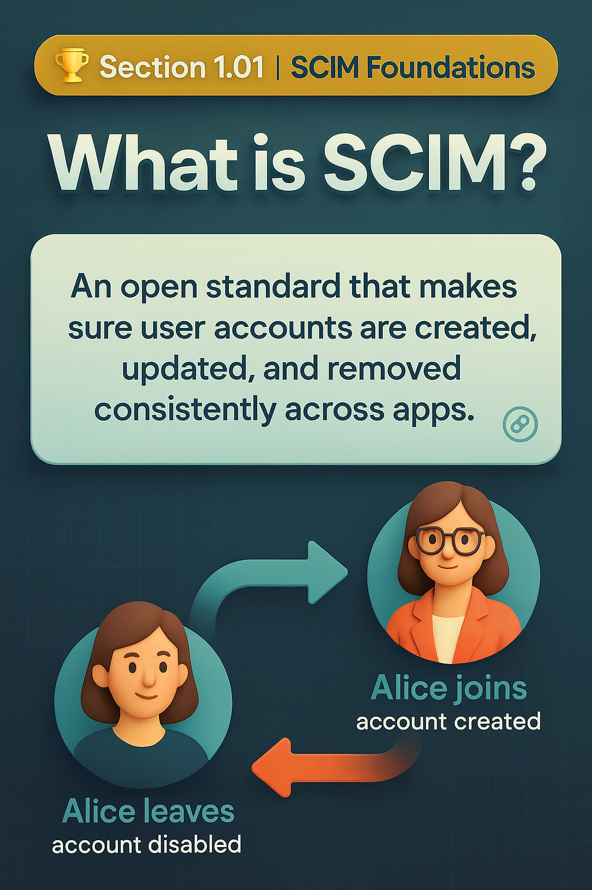

# 🏆 Section 1.01 | Foundations | “What is SCIM?”

If you work with cloud apps, identity providers, or anything around IAM, you’ve probably heard of **SCIM**. But what is it really, and why does it matter so much? Let’s break it down in a way that’s clear enough for beginners and still valuable for pros.  

---

## ❗ What Problem Does SCIM Solve?  
Before SCIM, every SaaS application had its own way of handling user accounts.  

⚠️ IT teams had to:  
- Manually create accounts in each app  
- Update details everywhere when roles changed  
- Disable accounts one by one when employees left  

The result?  
⏳ Delays, ❌ errors, and 🔓 orphaned accounts left active in systems.  

This wasn’t secure, efficient, or scalable.  

---

## 🌐 Enter SCIM: The Standard Protocol  
SCIM (**System for Cross-domain Identity Management**) is an **open standard** that solved these problems.  

Here’s what it provides:  
- 📑 **Common schemas** → consistent structure for identity data like `userName`, `emails`, and `groups`  
- 🔗 **Standard protocol** → REST + JSON APIs to create, update, and delete users  
- 🔄 **Interoperability** → one integration works across multiple apps  

Today, most major SaaS apps (Salesforce, Zoom, Slack, ServiceNow) and IdPs (Okta, Entra ID, Ping) support SCIM.  

---

## 🔄 How SCIM Works in Real Life  
Every employee’s journey is supported end-to-end:  

👶 **Joiner** → HR adds a new hire → SCIM auto-creates accounts in connected apps  
👔 **Mover** → Employee changes role → SCIM updates permissions and group memberships  
👋 **Leaver** → Exit triggered → SCIM disables accounts everywhere within minutes  

The flow looks like this:  
```
HR System → Identity Provider → SCIM → Applications
```  

✅ With SCIM → automated, real-time, compliant  
❌ Without SCIM → tickets, delays, and high risk  

---

## 🌍 Why SCIM Matters  
For organizations:  
- 🔒 **Security** → ensures ex-employees lose access immediately  
- 📝 **Governance** → closes compliance gaps with clean audit logs  
- ⚡ **Efficiency** → reduces IT workload with automation  

For professionals:  
- 🏆 **Industry standard** → SCIM is the backbone of provisioning in IAM/IGA/CIAM  
- 📈 **Career skill** → knowing SCIM is a practical advantage in cloud identity roles  

---

## ⚙️ A Closer Look: The Core of SCIM  

Every SCIM resource follows some mandatory rules.  

### 🧩 Core attributes you’ll see everywhere:  
- `id` → unique identifier set by the server  
- `schemas` → tells which schema(s) are applied  
- `meta` → timestamps like `created`, `lastModified`  
- `externalId` → optional client-managed ID, often from HR  

### Example: Creating a User  
```http
POST /Users
{
  "schemas": ["urn:ietf:params:scim:schemas:core:2.0:User"],
  "userName": "jane.doe",
  "name": { "givenName": "Jane", "familyName": "Doe" },
  "emails": [{ "value": "jane.doe@example.com", "primary": true }]
}
```  

### Example: Disabling a User  
```http
PATCH /Users/2819c223...
{
  "schemas":["urn:ietf:params:scim:api:messages:2.0:PatchOp"],
  "Operations": [{ "op": "replace", "path": "active", "value": false }]
}
```  

👉 Instead of deleting, `active:false` is preferred because it keeps the audit trail intact.  

---

## 🏢 Real-World Impact  
A global enterprise integrated Workday HR with Entra ID using SCIM across 15 SaaS apps.  

📉 **Before SCIM**:  
- 3,000 accounts manually created each month  
- 3–5 day onboarding delays  
- 8% of ex-employee accounts still active  

📈 **After SCIM**:  
- Provisioning fully automated  
- Offboarding finished in under 10 minutes  
- IT workload reduced by 70%  
- Audit passed with zero issues  

---

## ⚠️ Common Pitfalls to Avoid  
Even with SCIM, mistakes happen. Watch out for:  
- 🚫 Forgetting to include `schemas` in every request  
- 🚫 Assuming PATCH works (some vendors only allow PUT)  
- 🚫 Using DELETE instead of `active:false` (loses history)  
- 🚫 Attribute mismapping (wrong entitlements)  
- 🚫 Relying on partial vendor implementations of SCIM  

✅ Always test with pilot users and check `/ServiceProviderConfig` for supported features.  

---

## 📝 Quick Self-Check  
1️⃣ Which RFC defines SCIM **protocol operations**?  
2️⃣ Which attribute is **mandatory** in every SCIM resource?  
3️⃣ A user is terminated in HR, but their Salesforce account stays active. What’s the most likely cause?  

---

## 🎯 Final Takeaway  
SCIM is the **foundation of modern provisioning**. It standardizes how identities are created, updated, and removed across applications, making identity management secure, efficient, and scalable.  

💡 If you’re new to IAM, start here. If you’re already in the field, SCIM is a skill you can’t ignore.  

✅ **In one line**: SCIM is the universal standard that makes identity management work in the real world.  

## 🔗 Navigation
👉 Back: [README](../README.md)  
👉 Next: [1.02 SCIM Architecture](1.02-scim-architecture.md)  
