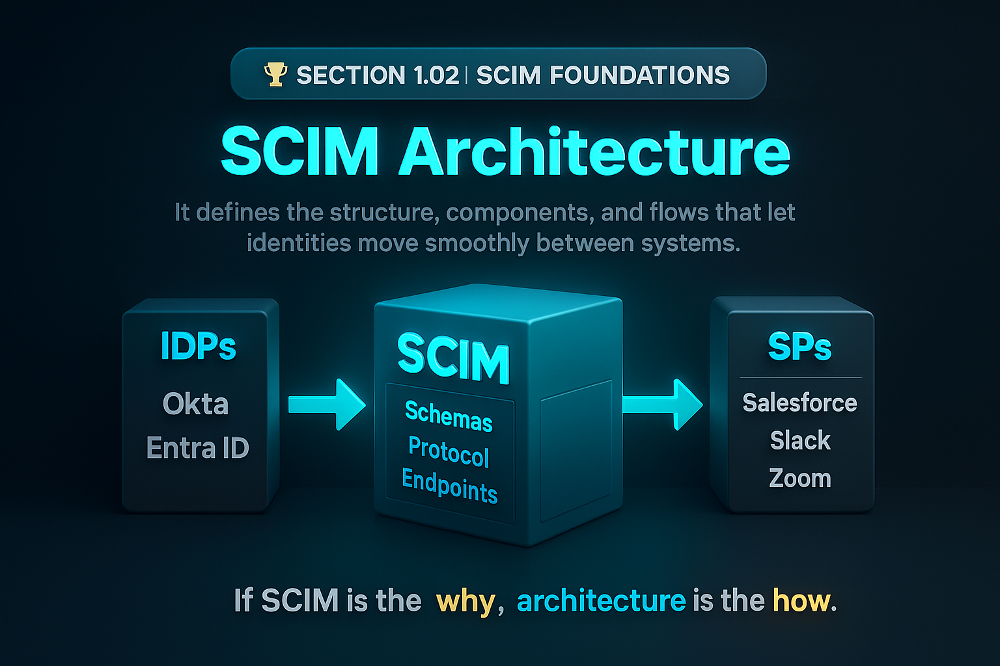

# 🏆 Section 1.02 | SCIM Foundations | “SCIM Architecture”

If you understand **what SCIM is**, the next step is learning its **architecture** — the building blocks that make the protocol actually work. This is where theory turns into a system you can design, implement, and troubleshoot.  

---

## 📖 What is SCIM Architecture?  
SCIM architecture defines **how the standard is structured** and **how different components interact** to provision and manage identities.  

At its heart, SCIM is about three things:  
- **Service Providers (SPs)** → SaaS apps that consume identity (Salesforce, Slack, Zoom)  
- **Identity Providers (IdPs)** → systems that manage identities (Okta, Entra ID, Ping)  
- **Schemas & Protocol** → the rules and APIs that connect the two  

---

## 🏗️ Core Components of SCIM Architecture  

### 1. **Schemas (RFC 7643)**  
Define the *shape* of identity data.  
- `User` schema → login, name, email, groups  
- `Group` schema → members, roles, entitlements  
- Extension schemas → custom attributes like `employeeNumber` or `costCenter`  

### 2. **Protocol (RFC 7644)**  
Defines the *actions*:  
- `POST /Users` → create  
- `PATCH /Users` → update  
- `DELETE /Users` → remove or disable  

### 3. **Endpoints**  
Service Providers expose standard endpoints:  
- `/Users`  
- `/Groups`  
- `/ServiceProviderConfig` (capabilities supported)  
- `/Schemas`  

### 4. **Flow Control**  
IdP acts as the source → SCIM requests → SP applies changes.  

---

## 🔄 Typical Provisioning Flow  

```
HR → Identity Provider → SCIM API → Application
```

- **Joiner** → HR adds record → IdP sends `POST /Users` → SP creates account  
- **Mover** → HR updates role → IdP sends `PATCH /Users` → SP updates attributes  
- **Leaver** → HR termination → IdP sends `PATCH active:false` → SP disables account  

---

## ⚙️ Why SCIM Architecture Matters  
- **Consistency** → apps don’t need custom connectors anymore  
- **Scalability** → one IdP integration can drive hundreds of apps  
- **Security** → accounts deprovisioned immediately, no orphaned users  
- **Extensibility** → supports both core and custom enterprise needs  

---

## 🏢 Real-World Example  
Imagine a company running Workday HR + Okta as IdP, provisioning into Salesforce, Zoom, and Slack.  

- Without SCIM → 3 custom connectors, mismatched attributes, errors everywhere.  
- With SCIM → one schema, one protocol, multiple apps onboarded seamlessly.  

---

## ⚠️ Common Pitfalls in Architecture  
- SPs implementing **partial SCIM** → some endpoints unsupported  
- Not checking `/ServiceProviderConfig` before relying on advanced features  
- Assuming attribute mappings are identical across apps  
- Forgetting to test **error handling** (e.g., what if a PATCH fails?)  

---

## 📝 Self-Check  
1️⃣ What role do **Service Providers** play in SCIM architecture?  
2️⃣ Which endpoint tells you the features a Service Provider supports?  
3️⃣ Why is defining schemas important in SCIM architecture?  

---

## 🎯 Final Takeaway  
SCIM architecture is the **blueprint that makes the standard work**. It defines the schemas, endpoints, and flows that let IdPs and SPs communicate consistently.  

💡 If SCIM itself is the “why,” architecture is the “how.”  

---

## 🔗 Navigation  
👉 Back: [1.01 What is SCIM?](1.01-what-is-scim.md)  
👉 Next: [1.03 Core Objects](1.03-core-objects.md)  
