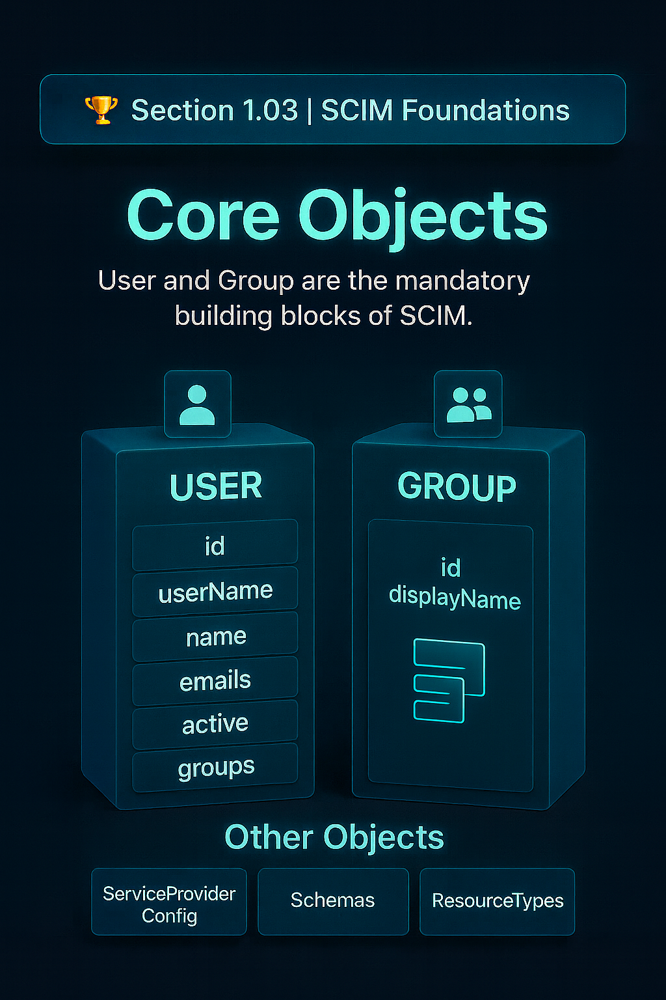

# 🏆 Section 1.03 | SCIM Foundations | “Core Objects”

When learning SCIM, it’s essential to understand the **core objects**. These objects are the foundation of the protocol — everything else in SCIM builds around them.  

---

## 📖 What are Core Objects?  
SCIM defines two **primary resource types** that every implementation supports:  

- **User** → represents an individual identity (employee, contractor, customer).  
- **Group** → represents a collection of users, often tied to roles, permissions, or application access.  

Other objects exist (like `ServiceProviderConfig`, `Schemas`, `ResourceTypes`) but **Users and Groups** are the mandatory building blocks.  

---

## 👤 The User Object  
A SCIM **User** holds attributes describing a person’s digital identity.  

### Key Attributes  
- `id` → unique server identifier (system-generated).  
- `userName` → login name (must be unique within a tenant).  
- `name` → structured with `givenName`, `familyName`.  
- `emails` → supports multiple values with one marked as primary.  
- `active` → true/false flag to enable or disable a user.  
- `groups` → references to Group objects this user belongs to.  

### Example: User Object  
```http
{
  "schemas": ["urn:ietf:params:scim:schemas:core:2.0:User"],
  "id": "2819c223-7f76-453a-919d-413861904646",
  "userName": "jane.doe",
  "name": {
    "givenName": "Jane",
    "familyName": "Doe"
  },
  "emails": [
    { "value": "jane.doe@example.com", "primary": true }
  ],
  "active": true
}
```  

---

## 👥 The Group Object  
A **Group** represents a set of Users. Groups are central for **managing permissions and entitlements** across applications.  

### Key Attributes  
- `id` → unique server identifier for the group.  
- `displayName` → human-readable name of the group.  
- `members` → array of references to User objects.  

### Example: Group Object  
```http
{
  "schemas": ["urn:ietf:params:scim:schemas:core:2.0:Group"],
  "id": "e9e30dba-f08f-4109-8486-d5c6a331660a",
  "displayName": "Engineering",
  "members": [
    {
      "value": "2819c223-7f76-453a-919d-413861904646",
      "display": "Jane Doe"
    }
  ]
}
```  

---

## 🔗 Relationship Between Users and Groups  
- Users can belong to multiple groups.  
- Groups reference Users as members.  
- This design makes **role-based access control (RBAC)** and entitlement management much easier.  

Flow example:  
```
User → belongs to → Groups → linked to → App roles/permissions
```  

---

## ⚠️ Common Pitfalls with Core Objects  
- Forgetting that `userName` must be unique across the tenant.  
- Confusing `id` (system-generated) with `externalId` (client-supplied).  
- Relying only on Groups without mapping attributes (some apps don’t honor Groups directly).  
- Not marking a primary email when multiple addresses exist.  

---

## 🏢 Real-World Example  
In an enterprise setup:  
- **Users** are provisioned from Workday via SCIM into Entra ID.  
- Groups like **Engineering**, **Finance**, and **HR** are automatically maintained.  
- Applications like Slack or Salesforce assign access based on these SCIM Groups, ensuring the right people have the right access.  

---

## 📝 Self-Check  
1️⃣ What are the two **mandatory SCIM core objects**?  
2️⃣ Which attribute ensures a User can log in uniquely within a tenant?  
3️⃣ How do Groups reference Users in SCIM?  

---

## 🎯 Final Takeaway  
SCIM Core Objects — **Users and Groups** — are the backbone of the standard. They make identity data portable and interoperable across different platforms.  

💡 If you don’t understand Users and Groups, you can’t master SCIM.  

---

## 🔗 Navigation  
👉 Back: [1.02 SCIM Architecture](1.02-scim-architecture.md)  
👉 Next: [1.04 SCIM Endpoints](1.04-scim-endpoints.md)  
