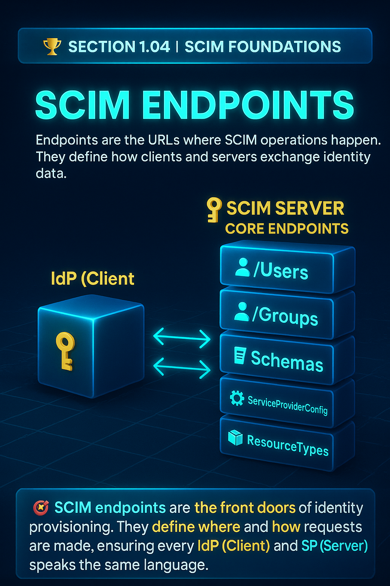

# 🏆 Section 1.04 | SCIM Foundations | “SCIM Endpoints”

Once you understand Users and Groups, the next step is learning about **SCIM endpoints**. Endpoints are the URLs where SCIM operations happen. They define how clients and servers exchange identity data.  

---

## 📖 What are SCIM Endpoints?  
SCIM endpoints are **standardized API paths** exposed by Service Providers. They let Identity Providers perform CRUD operations on identity resources.  

Think of them as the "doors" where provisioning requests are sent and processed.  

---

## 🔑 Core SCIM Endpoints  

### 1. `/Users`  
- The most common endpoint.  
- Handles creation, updates, reads, and deletions of user resources.  
- Supports operations like `POST`, `GET`, `PATCH`, and `DELETE`.  

### 2. `/Groups`  
- Manages group resources.  
- Lets IdPs add or remove members and manage group assignments.  

### 3. `/Schemas`  
- Provides details about supported schemas.  
- Useful for understanding which attributes are available for customization.  

### 4. `/ServiceProviderConfig`  
- Describes which SCIM features the Service Provider supports.  
- Example: Does the SP support filtering, PATCH operations, bulk requests?  

### 5. `/ResourceTypes`  
- Lists available resource types on the Service Provider.  
- Ensures the IdP knows what kind of objects can be provisioned.  

---

## 🔄 How Endpoints Work in Practice  

### Example: Get a User  
```http
GET /Users/2819c223-7f76-453a-919d-413861904646
```  

### Example: Create a Group  
```http
POST /Groups
{
  "schemas": ["urn:ietf:params:scim:schemas:core:2.0:Group"],
  "displayName": "Engineering",
  "members": []
}
```  

### Example: Check Service Provider Capabilities  
```http
GET /ServiceProviderConfig
```  

---

## ⚙️ Why Endpoints Matter  
- **Interoperability** → Same endpoints across vendors.  
- **Predictability** → Developers know exactly where to send requests.  
- **Transparency** → `/Schemas` and `/ServiceProviderConfig` explain what is supported.  
- **Scalability** → Once you know the endpoints, you can automate provisioning across many apps.  

---

## 🏢 Real-World Example  
An IdP like Okta provisions into Salesforce via SCIM:  
- `POST /Users` creates new Salesforce users.  
- `PATCH /Groups` updates team memberships.  
- `GET /ServiceProviderConfig` confirms Salesforce supports PATCH before Okta uses it.  

This standardization saves time and prevents custom integration work.  

---

## ⚠️ Common Pitfalls with Endpoints  
- Assuming all endpoints are supported (some SPs only partially implement SCIM).  
- Forgetting to check `/ServiceProviderConfig` before relying on features like PATCH.  
- Overlooking `/Schemas` and missing important attributes.  
- Not validating error responses properly.  

---

## 📝 Self-Check  
1️⃣ Which endpoint is used to check whether a Service Provider supports PATCH?  
2️⃣ What does the `/Schemas` endpoint provide?  
3️⃣ How does `/ResourceTypes` help in provisioning?  

---

## 🎯 Final Takeaway  
SCIM endpoints are the **front doors of identity provisioning**. They define where and how requests are made, ensuring every IdP and SP speaks the same language.  

💡 Mastering endpoints is key to debugging and building reliable integrations.  

---

## 🔗 Navigation  
👉 Back: [1.03 Core Objects](1.03-core-objects.md)  
👉 Next: [1.05 Lifecycle Operations](1.05-lifecycle-operations.md)  
