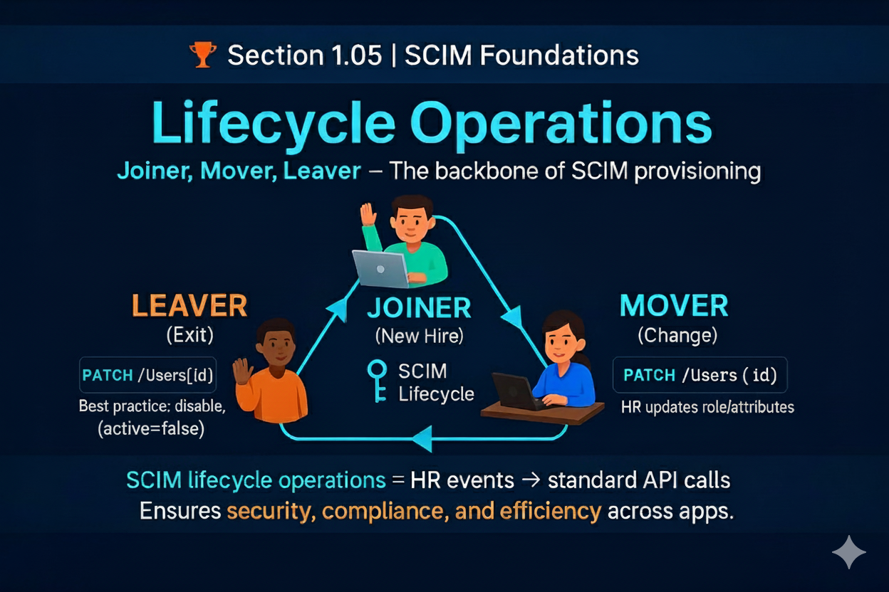

# 🏆 Section 1.05 | SCIM Foundations | “Lifecycle Operations”

Identity management is not just about creating accounts. It is about handling the entire **user lifecycle** — from the moment a person joins an organization until the day they leave. SCIM provides a consistent way to represent these events through standard operations.  

---

## 📖 What are Lifecycle Operations?  
Lifecycle operations describe how identities are **created, updated, and deprovisioned** across applications. In SCIM, these events are usually tied to HR actions:  
- **Joiner** → a new hire needs accounts.  
- **Mover** → a role or department change requires updates.  
- **Leaver** → an exit requires disabling access.  

---

## 🔑 Core Lifecycle Operations  

### 1. Joiner (New Hire)  
- Triggered when HR adds a new employee.  
- IdP creates the user across connected apps.  
- SCIM request:  
```http
POST /Users
{
  "schemas": ["urn:ietf:params:scim:schemas:core:2.0:User"],
  "userName": "jane.doe",
  "name": { "givenName": "Jane", "familyName": "Doe" },
  "emails": [{ "value": "jane.doe@example.com", "primary": true }]
}
```  

### 2. Mover (Role or Attribute Change)  
- Triggered when HR updates attributes (title, department, manager).  
- SCIM request updates existing user:  
```http
PATCH /Users/2819c223-7f76-453a-919d-413861904646
{
  "schemas":["urn:ietf:params:scim:api:messages:2.0:PatchOp"],
  "Operations": [{
    "op": "replace",
    "path": "title",
    "value": "Senior Engineer"
  }]
}
```  

### 3. Leaver (Exit or Termination)  
- Triggered when HR marks a user as terminated.  
- Best practice is to disable, not delete, to preserve audit trails:  
```http
PATCH /Users/2819c223-7f76-453a-919d-413861904646
{
  "schemas":["urn:ietf:params:scim:api:messages:2.0:PatchOp"],
  "Operations": [{
    "op": "replace",
    "path": "active",
    "value": false
  }]
}
```  

---

## ⚙️ Why Lifecycle Operations Matter  
- **Security** → ensures ex-employees lose access immediately.  
- **Compliance** → prevents orphaned accounts, leaves audit records intact.  
- **Efficiency** → automates provisioning without IT tickets.  
- **Consistency** → same operations work across vendors and apps.  

---

## 🏢 Real-World Example  
An enterprise connects Workday to Entra ID using SCIM.  
- A new developer is hired → SCIM `POST /Users` automatically creates accounts in GitHub and Slack.  
- Developer moves to another project → SCIM `PATCH /Users` updates their groups and entitlements.  
- When they resign → SCIM `PATCH active:false` disables accounts in all systems within minutes.  

This removes manual work and closes major security risks.  

---

## ⚠️ Common Pitfalls  
- Using `DELETE` instead of disabling → breaks audit trail.  
- Forgetting to handle movers → users end up with wrong access.  
- Assuming all vendors support PATCH → some require PUT.  
- Not monitoring failed lifecycle events → leaves gaps in provisioning.  

---

## 📝 Self-Check  
1️⃣ Which SCIM operation is recommended for disabling a user during offboarding?  
2️⃣ What event triggers a mover operation in SCIM?  
3️⃣ Why is `active:false` preferred over `DELETE` for leaver events?  

---

## 🎯 Final Takeaway  
SCIM lifecycle operations map real-world HR events into **standard API calls**. They keep identity data in sync, enforce security, and ensure compliance across applications.  

💡 Joiner, mover, and leaver operations are the backbone of provisioning in any SCIM deployment.  

---

## 🔗 Navigation  
👉 Back: [1.04 SCIM Endpoints](1.04-scim-endpoints.md)  
👉 Next: [1.06 Filtering Basics](1.06-filtering-and-querying.md)  
