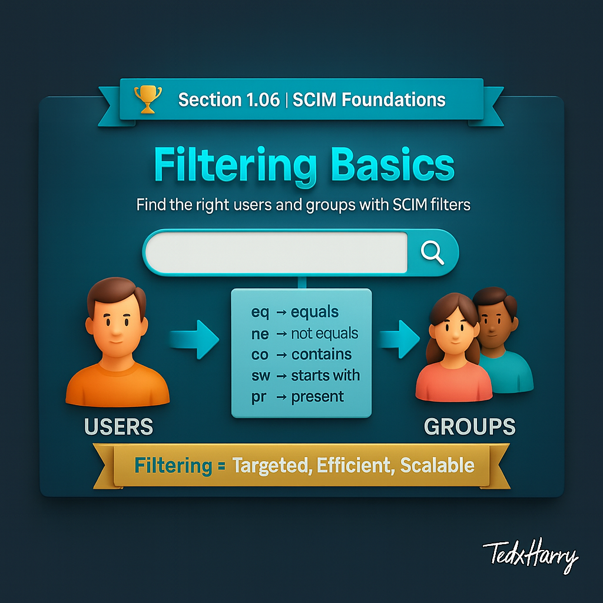

 
# 🏆 Section 1.06 | SCIM Foundations | “Filtering Basics”

SCIM is not just about creating and updating users. Very often, Identity Providers need to **search for specific users or groups**. That is where filtering comes in. SCIM defines a standard way to query resources so you can find exactly what you need.  

---

## 📖 What is Filtering in SCIM?  
Filtering is the ability to **search resources using conditions**. It lets clients narrow down results instead of retrieving everything.  

For example:  
- Find a user by email.  
- Find all active users.  
- Find all members of a department.  

---

## 🔑 Basic Filter Syntax  
Filtering is supported on `GET` requests, usually on `/Users` or `/Groups`.  

Format:  
```
GET /Users?filter=<attribute> <operator> <value>
```  

### Common Operators  
- `eq` → equals  
- `ne` → not equals  
- `co` → contains  
- `sw` → starts with  
- `pr` → present (attribute exists)  

---

## 🧩 Examples of Filters  

### 1. Find a User by Email  
```http
GET /Users?filter=emails.value eq "jane.doe@example.com"
```  

### 2. Find Active Users  
```http
GET /Users?filter=active eq true
```  

### 3. Find Users in a Department  
```http
GET /Users?filter=department eq "Engineering"
```  

### 4. Find Users Missing a Phone Number  
```http
GET /Users?filter=phoneNumbers pr false
```  

---

## ⚙️ Why Filtering Matters  
- **Efficiency** → reduces load by fetching only needed data.  
- **Troubleshooting** → helps find problem accounts quickly.  
- **Automation** → scripts and workflows depend on filters to target users.  

---

## 🏢 Real-World Example  
In an enterprise setup, HR marks a list of employees as inactive. Instead of retrieving all 50,000 users, the IdP can call:  

```http
GET /Users?filter=active eq false
```  

This instantly returns only inactive users, making deprovisioning workflows faster and more reliable.  

---

## ⚠️ Common Pitfalls  
- Not all vendors fully support filtering.  
- Complex filters may not be implemented by every Service Provider.  
- Forgetting quotes around string values.  
- Using unsupported attributes in filters.  

---

## 📝 Self-Check  
1️⃣ Which operator is used to check if an attribute exists in SCIM?  
2️⃣ Write a filter to return all users whose `department` is “Finance”.  
3️⃣ Why is filtering important for automation?  

---

## 🎯 Final Takeaway  
Filtering is one of the most powerful parts of SCIM. It makes queries targeted, efficient, and scalable, while reducing unnecessary data transfers.  

💡 Even simple filters like “find active users” or “find by email” can save hours of manual work.  

---

## 🔗 Navigation  
👉 Back: [1.05 Lifecycle Operations](1.05-lifecycle-operations.md)  
👉 Next: [1.07 Common Errors & Pitfalls](1.07-common-errors-and-pitfalls.md)  
