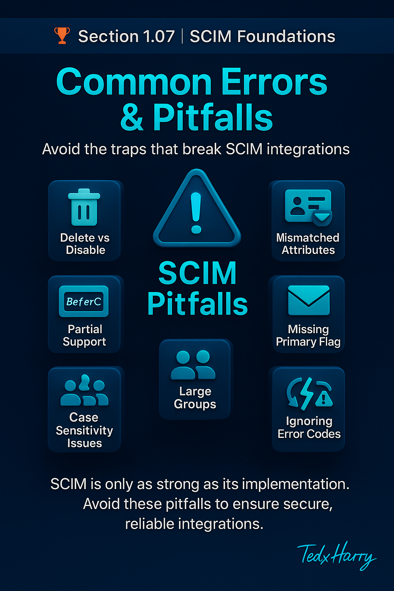

 
# 🏆 Section 1.07 | SCIM Foundations | “Common Errors & Pitfalls”

Even though SCIM is a standard, many challenges appear when implementing it in real environments. Beginners and professionals alike often run into the same mistakes. Understanding these **common errors and pitfalls** will help you avoid wasted time, failed integrations, and security risks.  

---

## 📖 Why Talk About Pitfalls?  
SCIM looks simple on paper: REST APIs, JSON payloads, Users and Groups. But in practice, different vendors implement SCIM with slight variations.  
- Some support only a **subset of the specification**.  
- Some return **non-standard errors**.  
- Others treat attributes differently than expected.  

If you don’t anticipate these issues, your integration may break silently or expose your organization to risks.  

---

## ⚠️ Common Pitfalls in SCIM  

### 1. **Delete vs Disable**  
- Many beginners assume deleting a user (`DELETE /Users/{id}`) is the right way to remove access.  
- But deletion wipes audit trails and can cause compliance issues.  
- Best practice: use `PATCH active:false` to **disable** the user instead.  

### 2. **Partial SCIM Implementations**  
- Not every Service Provider supports all endpoints (`/Groups`, `/Schemas`, `/Bulk`).  
- Relying on a feature that isn’t implemented leads to failed provisioning.  
- Always check `/ServiceProviderConfig` first to see what is supported.  

### 3. **Mismatched Attributes**  
- Example: one app expects `userName` as an email, another as a unique username.  
- If mappings aren’t set correctly, provisioning fails or creates duplicates.  
- Always verify attribute mapping before onboarding a new app.  

### 4. **Forgetting Primary Flags**  
- Multi-valued attributes like `emails` need a primary marked.  
- Without `primary:true`, apps may pick the wrong email for login or notifications.  

### 5. **PATCH vs PUT Confusion**  
- Some vendors don’t support `PATCH` correctly.  
- Using `PUT` when `PATCH` is expected (or vice versa) can overwrite attributes or fail silently.  

### 6. **Ignoring Error Codes**  
- SCIM errors provide details (`400 Bad Request`, `409 Conflict`, `500 Server Error`).  
- Not handling these codes can leave users half-provisioned.  
- Example: `409 Conflict` often means `userName` is already in use.  

### 7. **Large Group Handling**  
- Adding thousands of members in one call often fails.  
- Groups should be updated incrementally or via `/Bulk` (if supported).  

### 8. **Case Sensitivity Issues**  
- Some SPs treat `userName` as case-sensitive, others don’t.  
- This causes duplicate accounts like `Jane.Doe` and `jane.doe`.  

### 9. **Lack of Monitoring**  
- Even if the integration works, missed errors or failed sync jobs go unnoticed.  
- Without monitoring, inactive users may retain access for weeks.  

---

## 🏢 Real-World Example  
A global enterprise integrated Salesforce with Entra ID using SCIM. Everything seemed fine until:  
- Users were being deleted (`DELETE`) instead of disabled. Compliance flagged missing records.  
- Some employees couldn’t log in because primary emails weren’t set.  
- A large group sync failed, leaving hundreds of users without access.  

After addressing these pitfalls (switching to `PATCH active:false`, fixing attribute mappings, breaking down group updates), provisioning became stable and audit-ready.  

---

## 📝 Self-Check  
1️⃣ Why is `PATCH active:false` preferred over `DELETE` when disabling a user?  
2️⃣ Which endpoint helps you confirm whether a Service Provider supports PATCH or Bulk operations?  
3️⃣ What happens if you forget to mark a primary email in SCIM?  

---

## 🎯 Final Takeaway  
SCIM is powerful, but it is only as good as its **implementation and configuration**. Knowing the common pitfalls — delete vs disable, partial support, mapping issues, missing primary flags, and error handling — will help you build **resilient, secure, and compliant SCIM integrations**.  

💡 The difference between a broken SCIM integration and a reliable one often comes down to avoiding these very mistakes.  

---

## 🔗 Navigation  
👉 Back: [1.06 Filtering Basics](1.06-filtering-and-querying.md)  
👉 Next: [1.08 Extensions](1.08-extensions.md)  
