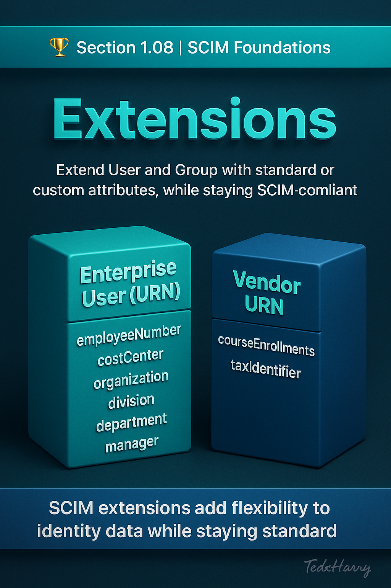

 

# 🏆 Section 1.08 | SCIM Foundations | “Extensions”

SCIM was designed to be flexible. While the **core User and Group schemas** cover most needs, organizations often require additional attributes to handle their unique business requirements. This is where **extensions** come in.  

---

## 📖 What are SCIM Extensions?  
Extensions allow vendors or enterprises to **add custom attributes** beyond the standard SCIM schemas, while still keeping requests compliant with the specification.  

There are two main types of extensions:  
- **Standard extensions** → defined in SCIM specifications (e.g., Enterprise User extension).  
- **Custom extensions** → defined by vendors or organizations to meet specific needs.  

---

## 🧩 Standard Extension: Enterprise User  
The **Enterprise User extension** (`urn:ietf:params:scim:schemas:extension:enterprise:2.0:User`) is the most widely used extension. It adds workplace-specific attributes such as:  
- `employeeNumber` → unique employee ID  
- `costCenter` → department or budget code  
- `organization` → company name  
- `division` → organizational division  
- `department` → specific department  
- `manager` → reference to another SCIM user  

### Example: Enterprise User Extension  
```http
{
  "schemas": [
    "urn:ietf:params:scim:schemas:core:2.0:User",
    "urn:ietf:params:scim:schemas:extension:enterprise:2.0:User"
  ],
  "userName": "jane.doe",
  "name": { "givenName": "Jane", "familyName": "Doe" },
  "emails": [ { "value": "jane.doe@example.com", "primary": true } ],
  "urn:ietf:params:scim:schemas:extension:enterprise:2.0:User": {
    "employeeNumber": "12345",
    "department": "Engineering",
    "manager": { "value": "2819c223-7f76-453a-919d-413861904646" }
  }
}
```  

---

## 🧩 Custom Extensions  
Vendors often create **custom extensions** for attributes unique to their applications.  
For example:  
- A learning platform might add `courseEnrollments`.  
- A financial system might add `taxIdentifier`.  

These use a **vendor-specific URN** to avoid conflicts.  

Example:  
```http
"schemas": [
  "urn:ietf:params:scim:schemas:core:2.0:User",
  "urn:example:params:scim:schemas:extension:custom:2.0:User"
],
"urn:example:params:scim:schemas:extension:custom:2.0:User": {
  "favoriteColor": "blue"
}
```  

---

## ⚙️ Why Extensions Matter  
- **Flexibility** → every organization has unique identity needs.  
- **Interoperability** → extensions keep payloads valid under SCIM rules.  
- **Scalability** → avoids hacking custom fields into unrelated attributes.  
- **Governance** → ensures important business attributes (cost centers, employee numbers) are tracked consistently.  

---

## 🏢 Real-World Example  
A multinational company provisions employees into ServiceNow using SCIM. Beyond standard fields like `userName` and `email`, they also need:  
- `employeeNumber` to match HR system IDs.  
- `costCenter` for financial approvals.  
- `manager` attribute to auto-populate reporting lines.  

Using the Enterprise User extension, these attributes sync seamlessly across HR, IT, and ServiceNow — reducing manual updates and ensuring governance.  

---

## ⚠️ Common Pitfalls  
- Forgetting to include the extension URN in the `schemas` array → attributes are ignored.  
- Overusing custom extensions where standard attributes would suffice.  
- Creating vendor-specific extensions that lock you into one system and reduce portability.  
- Not validating extensions across apps → one app may drop unknown attributes.  

---

## 📝 Self-Check  
1️⃣ Which SCIM extension adds `employeeNumber`, `department`, and `manager` attributes?  
2️⃣ Why must the extension URN be included in the `schemas` array of a SCIM request?  
3️⃣ What risks do overusing custom extensions create?  

---

## 🎯 Final Takeaway  
SCIM extensions give organizations the **flexibility to extend identity data** while staying within the protocol. Standard extensions like the Enterprise User are widely adopted, while custom extensions allow for unique requirements.  

💡 Use extensions wisely: rely on standards when possible, and ensure custom extensions don’t create lock-in or break interoperability.  

---

## 🔗 Navigation  
👉 Back: [1.07 Common Errors & Pitfalls](1.07-common-errors-and-pitfalls.md)  
👉 Next: [1.09 ServiceProviderConfig in Practice](1.09-service-provider-config.md)  
