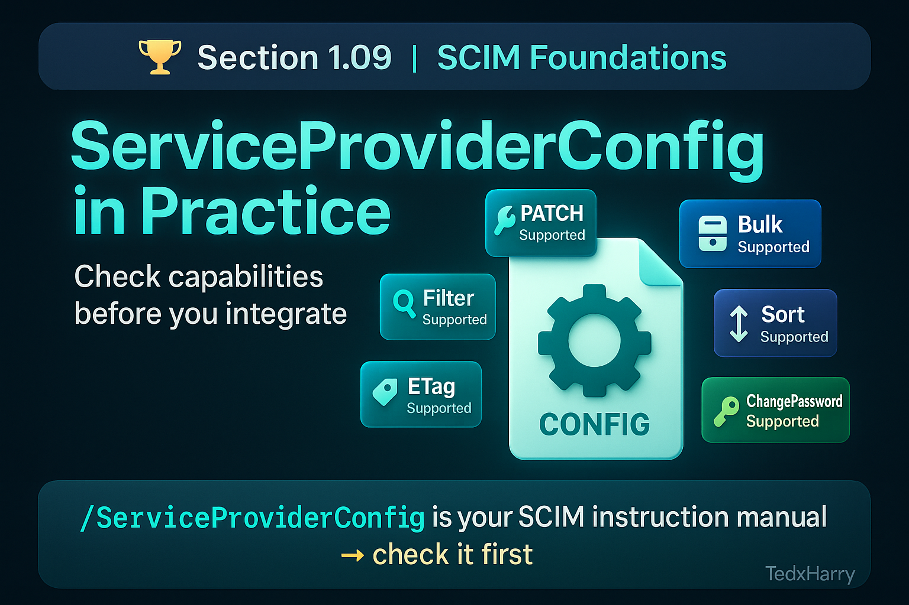

 
# 🏆 Section 1.09 | SCIM Foundations | “ServiceProviderConfig in Practice”

Before diving into advanced SCIM usage, one of the most overlooked yet essential steps is checking the **ServiceProviderConfig** endpoint. This tells you exactly what a Service Provider supports — and just as importantly, what it does *not* support. Skipping this step leads to failed integrations and hours of troubleshooting.  

---

## 📖 What is ServiceProviderConfig?  
The `/ServiceProviderConfig` endpoint provides a **capabilities document**. It describes which parts of the SCIM specification are implemented by a Service Provider.  

This helps an Identity Provider (IdP) adjust its behavior. For example, if PATCH isn’t supported, the IdP must use PUT instead.  

---

## 🔑 Key Features Reported by ServiceProviderConfig  
When you query:  

```http
GET /ServiceProviderConfig
```  

You’ll typically see responses like:  

```json
{
  "patch": { "supported": true },
  "bulk": { "supported": false },
  "filter": { "supported": true, "maxResults": 200 },
  "changePassword": { "supported": true },
  "sort": { "supported": false },
  "etag": { "supported": true }
}
```  

### Common Capability Flags  
- **patch.supported** → Does the SP allow PATCH operations?  
- **bulk.supported** → Can you send batch requests?  
- **filter.supported** → Are queries supported, and with what limits?  
- **sort.supported** → Can results be ordered?  
- **etag.supported** → Does the SP use versioning to detect changes?  
- **changePassword.supported** → Is password reset via SCIM allowed?  

---

## ⚙️ Why ServiceProviderConfig Matters  
- **Prevents failed requests** → You don’t try unsupported operations.  
- **Saves time** → No guessing or reverse-engineering capabilities.  
- **Improves reliability** → IdP adapts to each SP’s actual implementation.  
- **Supports compliance** → Ensures consistent use of supported features.  

---

## 🏢 Real-World Example  
An IdP team integrated SCIM with a SaaS HR system. They assumed PATCH was supported for updating user attributes. In reality, the system only supported PUT. Every update request failed silently.  

After checking `/ServiceProviderConfig`, they reconfigured the connector to use PUT — and provisioning stabilized immediately.  

---

## ⚠️ Common Pitfalls  
- Not checking `/ServiceProviderConfig` at all.  
- Ignoring maximum limits like `filter.maxResults`.  
- Assuming all vendors support PATCH or Bulk.  
- Forgetting that capability may differ even between the same vendor’s products.  

---

## 📝 Self-Check  
1️⃣ Which SCIM endpoint tells you if PATCH or Bulk is supported by a Service Provider?  
2️⃣ Why is it risky to assume filtering is always supported?  
3️⃣ How can checking ServiceProviderConfig save time in troubleshooting?  

---

## 🎯 Final Takeaway  
The `/ServiceProviderConfig` endpoint is like the **instruction manual** for each SCIM integration. Always check it first. It ensures you know exactly what features are supported and helps you avoid common pitfalls.  

💡 A stable SCIM deployment starts with respecting what `/ServiceProviderConfig` tells you.  

---

## 🔗 Navigation  
👉 Back: [1.08 Extensions](1.08-extensions.md)  
👉 Next: [2.01 Core Schema Overview](../scim-in-practice/2.01-core-schema-overview.md)  
