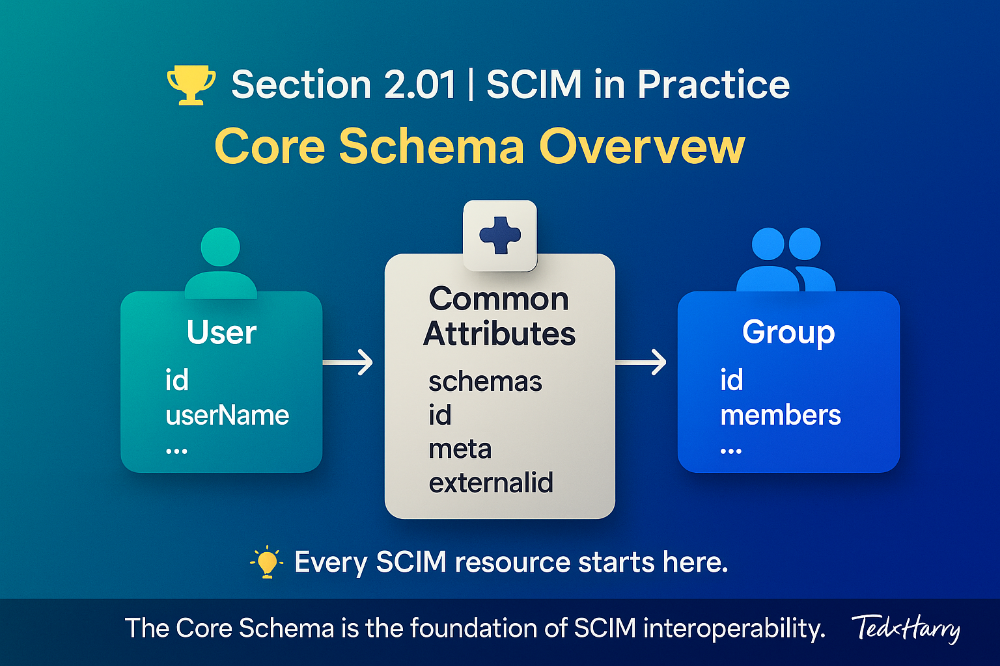

# 🏆 Section 2.01 | SCIM in Practice | “Core Schema Overview”

Once you’ve understood SCIM fundamentals, the next step is learning about its **core schema**, the backbone of how identity data is structured and exchanged. Everything in SCIM, from Users to Groups to Extensions, is based on this schema defined in **RFC 7643**.  

---

## 📖 What is the SCIM Core Schema?  

The **SCIM core schema** defines the standard attributes and structure for the most common identity resources. These include:  

- **User** → represents a person in an organization.  
- **Group** → represents a collection of users.  

Every SCIM resource shares a **common set of attributes** (`id`, `schemas`, `meta`, etc.).  
On top of this, resource-specific attributes (like `userName` for Users or `members` for Groups) are added.  

---

## 🧩 The Building Blocks of Every SCIM Resource  

### 1. `schemas` (Mandatory)  

- An array listing all schemas that apply to the resource.  
- Tells the Service Provider whether the object is a **User**, **Group**, or an **extension**.  
- Without this, the request **will fail**.  

Example:  

```json
"schemas": ["urn:ietf:params:scim:schemas:core:2.0:User"]
```

If the resource includes extensions, you’ll see multiple schema URNs listed.  

---

### 2. `id` (Mandatory, Server-assigned)  

- A **unique identifier** generated by the Service Provider when the resource is created.  
- Must remain stable for the lifetime of the resource.  
- Always **read-only** to clients.  

---

### 3. `externalId` (Optional, Client-assigned)  

- A **client-assigned identifier** used to map external systems to SCIM records.  
- Commonly set to an HR system’s employee ID.  
- Useful for integrations to ensure one SCIM object maps to one external record.  

⚠️ **Important**: `id` and `externalId` are not the same.  
- `id` → assigned by the Service Provider.  
- `externalId` → assigned by the client (IdP, HR, or another source).  

---

### 4. `meta` (Mandatory, Server-assigned)  

Contains metadata about the resource:  

```json
"meta": {
  "resourceType": "User",
  "created": "2025-01-15T04:56:22Z",
  "lastModified": "2025-02-01T11:42:55Z",
  "version": "W/\"123456\"",
  "location": "https://example.com/scim/v2/Users/2819c223"
}
```

- `resourceType` → tells what kind of resource this is.  
- `created` / `lastModified` → timestamps for auditing and synchronization.  
- `version` → works like a change counter; shows if the record has been updated since last sync.  
- `location` → the full URL of this SCIM resource.  

---

### 5. `userName` (Mandatory for User Resources)  

- The unique identifier for the user — often the login name.  
- Must be unique across the system.  
- Required whenever you create a User resource.  

Example:  

```json
"userName": "jane.doe"
```

---

### 6. `displayName` and `name` (Optional, but Common)  

Define how a user’s name is stored and displayed.  

```json
"name": {
  "givenName": "Jane",
  "familyName": "Doe",
  "formatted": "Jane Doe"
}
```

`displayName` is often used in UIs to show a friendly name.  

---

### 7. Multi-Valued Attributes  

Some attributes can store multiple values (emails, phone numbers, roles, etc.).  
Each item can have a `type` and a `primary` flag.  

Example:  

```json
"emails": [
  { "value": "jane.doe@example.com", "type": "work", "primary": true },
  { "value": "jane.personal@example.com", "type": "home" }
]
```

---

## ⚙️ Why the Core Schema Matters  

- **Consistency** → ensures uniform identity representation across systems.  
- **Interoperability** → enables IdPs and SPs to exchange data reliably.  
- **Scalability** → extensions build on the same foundation.  
- **Governance** → metadata (`meta`) supports compliance and audit tracking.  

---

## 🏢 Real-World Example  

### User  
An organization provisions users from Workday into Okta using SCIM.  

- Workday’s employee record becomes a SCIM **User** object.  
- The user has `userName`, `emails`, and `externalId` from Workday.  
- The provisioning connector uses `meta.lastModified` to detect changes and update only modified users.  

### Group  
Workday’s Department = “Finance” can map to a SCIM **Group** object.  

```json
{
  "displayName": "Finance",
  "members": [
    { "value": "2819c223" },
    { "value": "9024fabc" }
  ]
}
```

This keeps department membership in sync between HR and IT systems.  

---

## ⚠️ Common Pitfalls  

- Forgetting `schemas` → request rejected.  
- Treating `id` as editable → it must stay read-only.  
- Confusing `id` and `externalId` → causes duplicates or mismatches.  
- Ignoring `meta` → without versioning/timestamps, sync may break.  
- Using `externalId` inconsistently → different systems won’t match records properly.  

---

## 📝 Self-Check  

1️⃣ What is the difference between `id` and `externalId`?  
2️⃣ Which attributes are mandatory in **every** SCIM resource?  
3️⃣ Why must the `schemas` attribute always be present?  
4️⃣ What role does `meta.version` play in sync operations?  

---

## 🎯 Final Takeaway  

The SCIM core schema is the **foundation of interoperability**.  
- Every resource (User, Group, or Extension) inherits from it.  
- A few attributes are mandatory (`schemas`, `id`, `userName` for Users).  
- Others are optional but highly useful (`emails`, `displayName`, `externalId`).  

💡 If you fully understand the core schema, the rest of SCIM, Users, Groups, and Extensions will feel like logical extensions of the same model.  

---

## 🔗 Navigation  

👉 Back: [1.09 ServiceProviderConfig in Practice](../1-foundations/1.09-service-provider-config.md)  
👉 Next: [2.02 User Schema Details](2.02-user-schema.md)  
