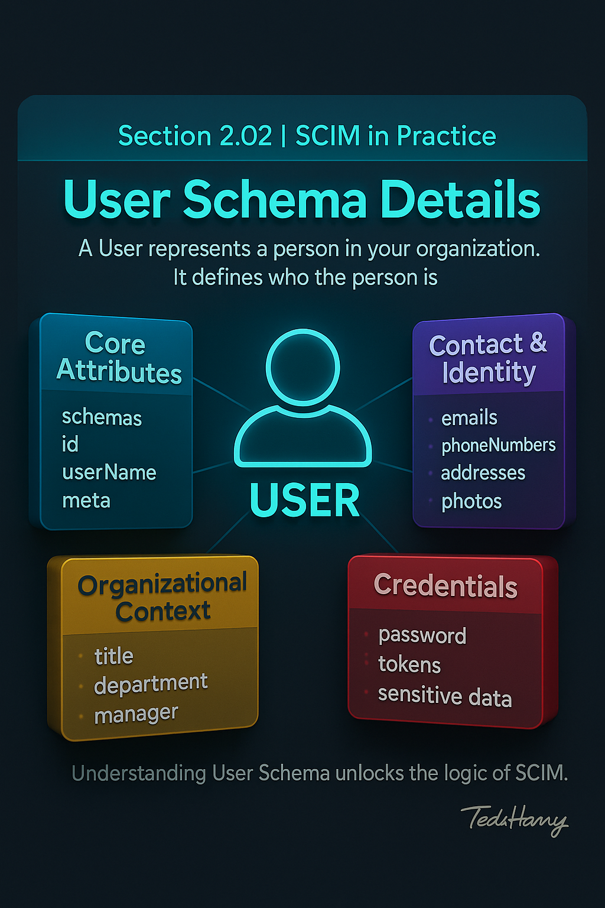

# 🏆 Section 2.02 | SCIM in Practice | “User Schema Details”

The **User schema** is the heart of SCIM.  
Every real-world SCIM integration starts with Users because provisioning always begins with creating or updating identity records.  

If you understand this schema well, most of SCIM will feel like logical variations.  

---

## 📖 What is the SCIM User Resource?  

A **User** represents a person in your organization.  

- It defines **who the person is** (login name, full name, contact info).  
- It shows **status** (active or not).  
- It can include **job context** (title, department, manager).  
- It supports **extensions** for extra attributes your business needs.  

⚠️ Vendors may not implement every attribute, but the overall structure follows **RFC 7643**.

---

## 🧩 Categories of User Attributes  

User attributes fall into four categories:  

1. **Core Attributes** → required for every User (`schemas`, `id`, `userName`, `meta`).  
2. **Contact and Identity Attributes** → how to reach the user (`emails`, `phoneNumbers`, `addresses`, `photos`).  
3. **Organizational Context** → workplace details (`title`, `roles`, `groups`, Enterprise extension).  
4. **Credentials** → sensitive fields like `password` (rarely supported).  

---

## 1️⃣ Core Attributes (Always Required or Essential)  

### `schemas` (Mandatory)  
- Tells the Service Provider what kind of object this is.  
- Without it, the request **will fail immediately**.  

```json
"schemas": ["urn:ietf:params:scim:schemas:core:2.0:User"]
```

👉 If you also use the Enterprise User extension, add its URN here.  
(*URN = Uniform Resource Name, a unique string that identifies a schema.*)

---

### `id` (Mandatory, Server-assigned)  
- Unique identifier created by the Service Provider.  
- Stable for the life of the User.  
- Always **read-only**.  
- Used in endpoints like `/Users/{id}`.  

---

### `externalId` (Optional, Client-assigned)  
- A way for **your system** to track this User across platforms.  
- Commonly set to the HR system’s employee ID.  
- Useful in migrations or reconciliation.  

⚠️ Never confuse this with `id`.  
- `id` → assigned by the Service Provider.  
- `externalId` → assigned by the client (HR, IdP, etc.).  

---

### `userName` (Mandatory)  
- The **login identifier** for the user.  
- Must be unique within the tenant.  
- Always required when creating a User.  

👉 Some apps expect an **email** here, others a **username**. Always check the Service Provider’s documentation.  

Example:  

```json
"userName": "jane.doe"
```

---

### `name` (Optional but Common)  

```json
"name": {
  "formatted": "Jane Doe",
  "familyName": "Doe",
  "givenName": "Jane",
  "middleName": "A",
  "honorificPrefix": "Dr.",
  "honorificSuffix": "Jr."
}
```

---

### `displayName` (Optional)  
- A friendly label shown in UIs.  
- Often matches `name.formatted` but not always.  

---

### `active` (Boolean)  
- Indicates whether the account is enabled.  
- Use `false` for offboarding instead of deleting.  
- Preserves history for audits.  

---

### `meta` (Mandatory, Server-assigned)  

```json
"meta": {
  "resourceType": "User",
  "created": "2025-01-15T04:56:22Z",
  "lastModified": "2025-02-01T11:42:55Z",
  "version": "W/\"123456\"",
  "location": "https://example.com/scim/v2/Users/2819c223"
}
```

- `created` / `lastModified` → timestamps for auditing and sync.  
- `version` → change counter to detect updates.  
- `location` → API endpoint for this resource.  

---

## 2️⃣ Contact and Identity Attributes  

### `emails`  
- Commonly required by apps.  
- Always mark one as **primary**.  

```json
"emails": [
  { "value": "jane.doe@company.com", "type": "work", "primary": true },
  { "value": "jane.personal@example.com", "type": "home" }
]
```

---

### `phoneNumbers`  

```json
"phoneNumbers": [
  { "value": "+1-312-555-0177", "type": "work", "primary": true },
  { "value": "+1-773-555-0199", "type": "mobile" }
]
```

---

### `addresses`  

```json
"addresses": [
  {
    "type": "work",
    "streetAddress": "123 Main St",
    "locality": "Chicago",
    "region": "IL",
    "postalCode": "60601",
    "country": "US",
    "primary": true
  }
]
```

---

### `photos`  

```json
"photos": [
  { "value": "https://cdn.example.com/photos/jane.jpg", "type": "photo" },
  { "value": "https://cdn.example.com/thumbs/jane.jpg", "type": "thumbnail" }
]
```

---

### `preferredLanguage`, `locale`, `timezone`  

```json
"preferredLanguage": "en",
"locale": "en_US",
"timezone": "America/Chicago"
```

---

## 3️⃣ Organizational Context and Roles  

### `title`, `userType`  

```json
"title": "Senior Engineer",
"userType": "Employee"
```

---

### `department`, `organization`  
- Often supported via the **Enterprise User extension**.  
- Check `/Schemas` or vendor docs.  

---

### `roles`  

```json
"roles": [
  { "value": "ProjectAdmin", "type": "application", "primary": true },
  { "value": "BetaTester", "type": "application" }
]
```

---

### `groups` (Read-only)  
- Lists groups the user belongs to.  
- Many providers populate this automatically.  
- You **cannot** update membership here — you must update the Group object.  

```json
"groups": [
  { "value": "e9e30dba-f08f-4109-8486-d5c6a331660a", "display": "Engineering" }
]
```

---

## 4️⃣ Enterprise User Extension  

URN: `urn:ietf:params:scim:schemas:extension:enterprise:2.0:User`  

```json
"schemas": [
  "urn:ietf:params:scim:schemas:core:2.0:User",
  "urn:ietf:params:scim:schemas:extension:enterprise:2.0:User"
],
"urn:ietf:params:scim:schemas:extension:enterprise:2.0:User": {
  "employeeNumber": "12345",
  "costCenter": "RND-ENG-001",
  "organization": "ExampleCorp",
  "division": "Engineering",
  "department": "Platform",
  "manager": { "value": "2819c223-7f76-453a-919d-413861904646" }
}
```

Notes:  
- Always include the URN in `schemas` or attributes will be ignored.  
- This extension is widely used in HR → IT integrations.  
- Only map fields if data quality upstream is reliable.  

---

## 5️⃣ Credentials  

### `password`  
- SCIM can carry passwords if supported.  
- Check `/ServiceProviderConfig` for `changePassword.supported`.  
- Prefer IdP-managed credentials (SSO).  
- Never log payloads containing `password`.  
- If used, ensure TLS and encryption.  

---

## 🧪 Complete Example User Payload  

```json
{
  "schemas": [
    "urn:ietf:params:scim:schemas:core:2.0:User",
    "urn:ietf:params:scim:schemas:extension:enterprise:2.0:User"
  ],
  "userName": "jane.doe",
  "name": { "givenName": "Jane", "familyName": "Doe", "formatted": "Jane A Doe" },
  "displayName": "Jane Doe",
  "active": true,
  "emails": [
    { "value": "jane.doe@company.com", "type": "work", "primary": true }
  ],
  "phoneNumbers": [
    { "value": "+1-312-555-0177", "type": "work", "primary": true }
  ],
  "addresses": [
    { "type": "work", "streetAddress": "123 Main St", "locality": "Chicago", "region": "IL", "postalCode": "60601", "country": "US", "primary": true }
  ],
  "photos": [
    { "value": "https://cdn.example.com/photos/jane.jpg", "type": "photo" }
  ],
  "preferredLanguage": "en",
  "locale": "en_US",
  "timezone": "America/Chicago",
  "urn:ietf:params:scim:schemas:extension:enterprise:2.0:User": {
    "employeeNumber": "12345",
    "department": "Platform",
    "manager": { "value": "2819c223-7f76-453a-919d-413861904646" }
  },
  "externalId": "WD-12345"
}
```

---

## ⚠️ Common Pitfalls and Their Impact  

- Missing `schemas` → request rejected.  
- Using `DELETE` for offboarding → audit history lost, orphaned records.  
- Assuming `userName` must be email → leads to failed logins.  
- Forgetting `primary:true` in multi-valued attributes → UI may not know which value to use.  
- Treating `id` as writable → Service Provider will reject it.  
- Sending `password` when unsupported → request fails.  
- Expecting `groups` to be writable in User → update membership in Group object.  

---

## 📝 Self-Check  

1️⃣ What are the mandatory attributes for a SCIM User resource?  
2️⃣ Why must `userName` always be unique and present?  
3️⃣ Why should you set `active:false` instead of deleting a user?  
4️⃣ What role does the Enterprise User extension play?  
5️⃣ How do you manage group membership correctly in SCIM?  

---

## 🎯 Final Takeaway  

The SCIM User schema is **the foundation of identity provisioning**.  

Focus on these for success:  
- `userName` → required, unique login identifier.  
- `emails` → mark one as `primary:true`.  
- `active` → drives lifecycle state.  
- `externalId` → maps to your external system.  
- Enterprise User extension → adds critical workplace context.  

💡 Once you master the User schema, the rest of SCIM becomes much easier.  

---

## 🔗 Navigation  

👉 Back: [2.01 Core Schema Overview](2.01-core-schema-overview.md)  
👉 Next: [2.03 Group Schema Details](2.03-group-schema.md)  
