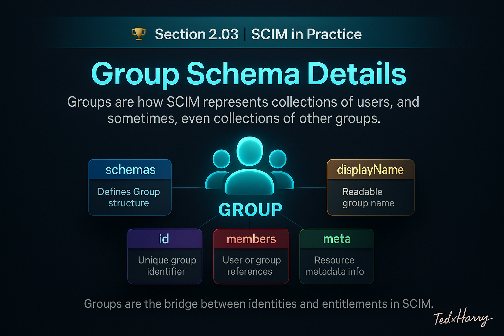

# 🏆 Section 2.03 | SCIM in Practice | “Group Schema Details”

Groups are how SCIM represents **collections of users** (and sometimes collections of groups).  
They are the foundation of scalable access control: instead of assigning permissions user by user, you grant them to a Group. Mastering the Group resource helps you manage application access, role assignment, and team-based permissions with confidence.  

This guide is **vendor neutral** and aligns with **RFC 7643** and **RFC 7644**.  

---

## 📖 What is a SCIM Group?  

A **Group** is a resource that holds **references to members**.  

- Members are usually Users.  
- Some implementations also support **nested groups** (groups inside groups).  
- Groups let you **manage access at scale**, without handling permissions one person at a time.  

**Schema URN** (always required):  

```text
urn:ietf:params:scim:schemas:core:2.0:Group
```

---

## 🧩 Core Attributes  

👉 **Mandatory attributes when creating a Group:**  
### `schemas`  
- Always includes the Group schema URN above.

### `id`  
- Server-assigned identifier for the group.  
- Read-only for clients.  
- Stable for the life of the resource.  

### `displayName`  
- Human-readable name of the group.  
- Required for create operations.  
- Must be unique and clear within the tenant.  

### `members`  
- An array of **references** to Users or Groups.  
- Each item can contain:  
  - `value` → the referenced resource’s `id` (**required**)  
  - `display` → optional, human-readable label  
  - `$ref` → sometimes included, full URL of the resource  

Example member reference:  

```json
{ "value": "2819c223-7f76-453a-919d-413861904646", "display": "Jane Doe" }
```

⚠️ Remember: `value` links the membership. `display` is just decoration.  

### `meta`  
- Metadata about the resource (creation time, last modification, location).  
- Crucial for auditing and detecting changes.  

---

## 🧪 JSON Examples  

### 1) Minimal Group (no members yet)  

```json
{
  "schemas": ["urn:ietf:params:scim:schemas:core:2.0:Group"],
  "displayName": "Engineering"
}
```

### 2) Group with multiple users  

```json
{
  "schemas": ["urn:ietf:params:scim:schemas:core:2.0:Group"],
  "displayName": "Engineering",
  "members": [
    { "value": "2819c223-7f76-453a-919d-413861904646", "display": "Jane Doe" },
    { "value": "8742ffde-df2c-4c1e-a8ab-3f7e6a2b8e21", "display": "Alex Kim" }
  ]
}
```

### 3) Nested group example  

Not all providers support nested groups. If supported, `members` may include a Group id.  

```json
{
  "schemas": ["urn:ietf:params:scim:schemas:core:2.0:Group"],
  "displayName": "Platform Leadership",
  "members": [
    { "value": "a1a1a1a1-1111-2222-3333-444444444444", "display": "Engineering" }, 
    { "value": "b2b2b2b2-2222-3333-4444-555555555555", "display": "Product" }
  ]
}
```

⚠️ Nested groups can create complexity: sync delays, loops, or authorization issues. Always confirm if your SP supports them.  

### 4) Add and remove members with PATCH  

Always use `PATCH` for incremental membership updates.  

```http
PATCH /Groups/a1a1a1a1-1111-2222-3333-444444444444
Content-Type: application/scim+json

{
  "schemas": ["urn:ietf:params:scim:api:messages:2.0:PatchOp"],
  "Operations": [
    {
      "op": "add",
      "path": "members",
      "value": [
        { "value": "2819c223-7f76-453a-919d-413861904646" }
      ]
    },
    {
      "op": "remove",
      "path": "members[value eq \"8742ffde-df2c-4c1e-a8ab-3f7e6a2b8e21\"]"
    }
  ]
}
```

👉 Using `PUT` replaces the entire list — dangerous for large groups. PATCH is safer and more efficient.  

---

## 🔄 Membership Synchronization Logic  

### Big picture  

```
IdP source of truth  →  SCIM /Groups  →  Service Provider
```

- **Push model**: IdP sends group creates and membership changes.  
- **Pull/reconcile**: IdP reads `/Groups` and `/Groups/{id}` to detect or fix drift.  
- **Incremental updates**: Prefer PATCH for specific adds/removes.  

### ASCII walkthrough of a typical sync  

```
[HR/Directory] --new hire--> [IdP]
[IdP] --add user to role--> [IdP Group]
[IdP] --PATCH add member--> [SP /Groups/{id}]
[SP] --updates entitlements--> [Application Access]
```

### Handling large groups  

- Break updates into **batches** if SP has request limits.  
- Use `/Bulk` only if supported and necessary.  
- For very large groups, use **incremental updates** (PATCH) instead of full list replacements.  
- Check if the SP has **maximum group size limits** (some cap at 1,000 or 5,000).  

---

## ✅ Best Practices  

- Treat `displayName` as the **canonical label** for people and automation.  
- Keep group names stable, human-readable, and unique. Avoid opaque IDs as names.  
- Always include `schemas` when creating Groups.  
- Use **PATCH** for membership changes (safe, incremental).  
- Document whether nested groups are supported. Flatten memberships if they are not.  
- Always use `id` values for member references (avoid relying only on display names).  

---

## ⚠️ Common Pitfalls (and Impact)  

- ❌ **Missing `displayName`** → many SPs reject the request.  
- ❌ **Missing `schemas`** → request fails immediately.  
- ❌ **Duplicate or invalid member IDs** → PATCH fails; validate before sending.  
- ❌ **Using PUT for membership changes** → accidentally wipes entire member list.  
- ❌ **Assuming nested groups work** → may not be supported; check `/ServiceProviderConfig`.  
- ❌ **Circular references in nested groups** → causes sync loops or broken authorization.  
- ❌ **Huge one-shot updates** → exceeds request limits, causing failures. Use batching or `/Bulk`.  

---

## 📝 Self-Check  

1️⃣ Which attributes are mandatory when creating a Group?  
2️⃣ Why is `PATCH` preferred over `PUT` for updating memberships?  
3️⃣ What risks come with nested groups?  
4️⃣ How should you handle very large group updates to avoid failures?  

---

## 🎯 Final Takeaway  

Groups in SCIM are **reference lists that connect users to access**.  
- Use clear, stable names.  
- Always include `schemas` and `displayName`.  
- Manage memberships incrementally with PATCH.  
- Verify support for nesting and avoid circular references.  
- Plan for scaling: batch large updates and respect SP limits.  

💡 Clean group design leads to simpler provisioning, fewer sync errors, and more predictable application access.  

---

## 🔗 Navigation  

👉 Back: [2.02 User Schema Details](2.02-user-schema.md)  
👉 Next: [2.04 Enterprise User Extension](2.04-enterprise-extension.md)  
