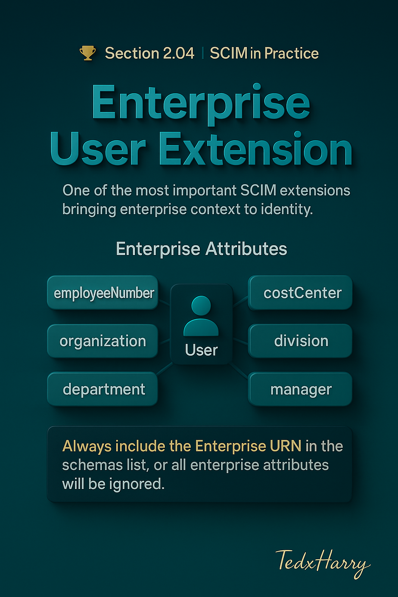

# 🏆 Section 2.04 | SCIM in Practice | “Enterprise User Extension”

The **Enterprise User Extension** is one of the most important extensions in SCIM.  
While the core schema gives you the foundation (userName, emails, groups), real-world identity systems almost always need *enterprise context*.  

This extension adds workplace-related attributes like **employeeNumber, costCenter, department, and manager**.  
It’s defined in **RFC 7643** and is widely supported in provisioning systems (Okta, Azure AD, SailPoint, Ping, etc.).  

---

## 📖 Why the Enterprise Extension Exists  

The core SCIM schema was intentionally kept minimal. But enterprises need more context to:  
- Link SCIM to **HR systems** like Workday, SAP SuccessFactors, or Oracle HCM.  
- Manage **reporting lines** (who is whose manager).  
- Organize access around **departments, divisions, and cost centers**.  
- Support auditing and compliance by tying identity to business structure.  

👉 Without this extension, you’d constantly need custom attributes or inconsistent mappings.  

---

## 🧩 Schema URN  

Every extension must declare its **URN** in the `schemas` attribute:  

```json
"schemas": [
  "urn:ietf:params:scim:schemas:core:2.0:User",
  "urn:ietf:params:scim:schemas:extension:enterprise:2.0:User"
]
```

This tells the Service Provider:  
- This is a User resource.  
- It also contains the Enterprise extension attributes.  

⚠️ If you forget to add the URN, all Enterprise attributes will be **ignored**.  

---

## 🧩 Enterprise Attributes in Detail  

The Enterprise extension defines a fixed set of attributes.  

### `employeeNumber`  
- Unique employee identifier in HR.  
- Often maps to a Workday/SAP Employee ID.  
- Stable across the user’s lifecycle.  
- Crucial for reconciliation (matching HR → IT accounts).  

### `costCenter`  
- Code or label representing financial cost assignment.  
- Used for chargebacks, audits, or departmental reporting.  

### `organization`  
- The broader organization name (e.g., “ExampleCorp”).  
- Useful when a system manages multiple orgs or subsidiaries.  

### `division`  
- High-level grouping under the organization (e.g., “Engineering”, “Marketing”).  

### `department`  
- More specific organizational unit (e.g., “Platform Team” inside Engineering).  
- Often used for access policies, reporting, or approvals.  

### `manager`  
- Reference to the user’s manager.  
- Contains:  
  - `value` → the SCIM `id` of the manager user.  
  - `displayName` → optional, human-readable name.  

Example:  

```json
"manager": {
  "value": "2819c223-7f76-453a-919d-413861904646",
  "displayName": "John Manager"
}
```

👉 This attribute is critical for **approval workflows** and **access requests** in IGA systems.  

---

## 🧪 Full Example User with Enterprise Extension  

```json
{
  "schemas": [
    "urn:ietf:params:scim:schemas:core:2.0:User",
    "urn:ietf:params:scim:schemas:extension:enterprise:2.0:User"
  ],
  "userName": "jane.doe",
  "name": { "givenName": "Jane", "familyName": "Doe" },
  "displayName": "Jane Doe",
  "active": true,
  "emails": [
    { "value": "jane.doe@company.com", "type": "work", "primary": true }
  ],
  "urn:ietf:params:scim:schemas:extension:enterprise:2.0:User": {
    "employeeNumber": "12345",
    "costCenter": "RND-ENG-001",
    "organization": "ExampleCorp",
    "division": "Engineering",
    "department": "Platform",
    "manager": {
      "value": "2819c223-7f76-453a-919d-413861904646",
      "displayName": "John Manager"
    }
  }
}
```

---

## ⚠️ Common Pitfalls (and Impact)  

- ❌ **Forgetting the URN in `schemas`** → Enterprise attributes silently dropped.  
- ❌ **Mapping unreliable HR data** → if `employeeNumber` isn’t unique or stable, provisioning breaks.  
- ❌ **Bad manager references** → if manager IDs don’t exist in SCIM yet, sync errors occur.  
- ❌ **Inconsistent use of division/department** → policies break when labels differ (e.g., “Finance” vs “FIN”).  

---

## ✅ Best Practices  

- Use **employeeNumber** as the primary HR correlation key (when available).  
- Always validate manager references (ensure managers exist before provisioning reports).  
- Normalize department/division names to avoid duplicates.  
- Document cost center codes so admins know what they represent.  
- Only map attributes you can trust — don’t sync junk HR fields.  

---

## 📝 Self-Check  

1️⃣ Why is the Enterprise extension critical for HR-driven identity provisioning?  
2️⃣ What happens if you forget to include the URN in the `schemas` list?  
3️⃣ Which attribute ties directly to reporting/approval workflows?  
4️⃣ Why is it risky to map unstable employeeNumber values?  

---

## 🎯 Final Takeaway  

The **Enterprise User Extension** bridges the gap between **bare-bones identity (core schema)** and **enterprise context**.  
It makes SCIM practical in real companies by adding:  
- Business identifiers (employeeNumber, costCenter)  
- Organizational structure (organization, division, department)  
- Manager relationships (approvals, reporting lines)  

💡 If you skip or misuse this extension, your integration will constantly need hacks or custom fields. Get it right, and SCIM flows align cleanly with HR and IT.  

---

## 🔗 Navigation  

👉 Back: [2.03 Group Schema Details](2.03-group-schema.md)  
👉 Next: [2.05 Custom Extensions](2.05-custom-extensions.md)  
