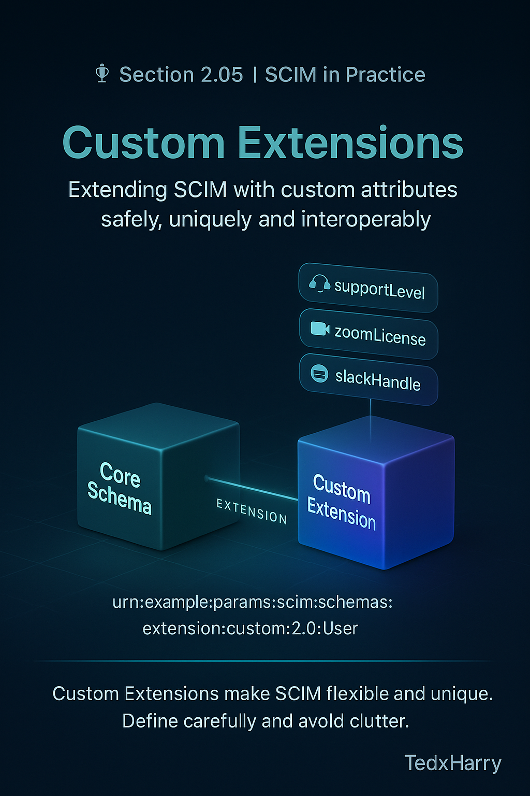

# 🏆 Section 2.05 | SCIM in Practice | “Custom Extensions”

The SCIM core schema and the Enterprise extension cover most identity attributes you’ll need.  
But enterprises and SaaS vendors often have **unique requirements** that don’t fit into the standard.  

That’s where **Custom Extensions** come in. They let you safely extend SCIM with additional attributes **without breaking interoperability**.  

---

## 📖 Why Custom Extensions Exist  

- **Every business has unique data**: license tiers, contractor types, building access badges.  
- **Vendors differentiate features**: SaaS products often have custom fields like `supportLevel`, `zoomLicense`, or `slackHandle`.  
- **Keeps SCIM future-proof**: instead of overloading existing attributes, you cleanly define your own namespace.  

👉 Without custom extensions, organizations end up forcing data into the wrong fields — leading to confusion and brittle integrations.  

---

## 🧩 Defining a Custom Extension  

Like Enterprise, a custom extension is declared with a **URN (Uniform Resource Name)**.  

Best practice: use a **reverse-DNS style** so it’s unique to your org or product.  

Example URN:  

```text
urn:example:params:scim:schemas:extension:custom:2.0:User
```

This avoids collisions with other vendors.  

---

## 🧪 Example: Adding License & Support Attributes  

Let’s say your SaaS app needs to track license tier and support level for each user.  

```json
{
  "schemas": [
    "urn:ietf:params:scim:schemas:core:2.0:User",
    "urn:example:params:scim:schemas:extension:custom:2.0:User"
  ],
  "userName": "jane.doe",
  "displayName": "Jane Doe",
  "emails": [
    { "value": "jane.doe@company.com", "type": "work", "primary": true }
  ],
  "urn:example:params:scim:schemas:extension:custom:2.0:User": {
    "licenseTier": "Enterprise",
    "supportLevel": "Premium"
  }
}
```

Here:  
- The `schemas` array includes both core + custom URNs.  
- Attributes live under the custom URN key.  
- If the SP doesn’t support them, they are ignored — but not rejected.  

---

## ⚠️ Common Pitfalls (and Impact)  

- ❌ **Forgetting to add the URN to `schemas`** → extension attributes ignored.  
- ❌ **Poor naming conventions** → attributes like `custom1`, `field2` become meaningless later.  
- ❌ **Duplicating Enterprise fields** → don’t redefine `department` or `manager` as custom. Use the standard ones.  
- ❌ **Assuming all SPs will persist unknown attributes** → some vendors silently drop them. Test before relying.  
- ❌ **Overloading SCIM with non-identity data** → keep extensions focused on identity context, not HR minutiae.  

---

## ✅ Best Practices  

- Always use **reverse-DNS style URNs** for uniqueness.  
- Document your extension schema and share it with integrators.  
- Limit attributes to those that are **stable, relevant, and critical**.  
- Reuse standard core/Enterprise attributes whenever possible — extend only when necessary.  
- Validate how Service Providers handle unknown attributes (ignore vs reject vs persist).  

---

## 🏢 Real-World Examples  

- **Zoom** → custom attribute for `zoomLicenseType`.  
- **Slack** → custom attribute for `slackUserType` (e.g., guest vs full member).  
- **Internal HR system** → `contractType` (full-time, part-time, contractor).  

These fields don’t exist in SCIM’s core spec — extensions make them possible.  

---

## 📝 Self-Check  

1️⃣ Why should you always use reverse-DNS style URNs for custom extensions?  
2️⃣ What happens if you forget to include the extension URN in the `schemas` list?  
3️⃣ Why is it a mistake to redefine Enterprise attributes as custom?  
4️⃣ Give one example of a good use case for a custom extension.  

---

## 🎯 Final Takeaway  

Custom Extensions give SCIM the flexibility to handle **unique business or vendor-specific attributes** while keeping interoperability intact.  

- Define a proper URN.  
- Always include it in the `schemas` list.  
- Use only when standard attributes don’t fit.  

💡 Extensions make SCIM practical for real-world SaaS apps and enterprise needs — but they must be designed carefully to avoid clutter and confusion.  

---

## 🔗 Navigation  

👉 Back: [2.04 Enterprise User Extension](2.04-enterprise-extension.md)  
👉 Next: [2.06 HTTP Methods & CRUD Behavior](2.06-http-methods-crud.md)  
