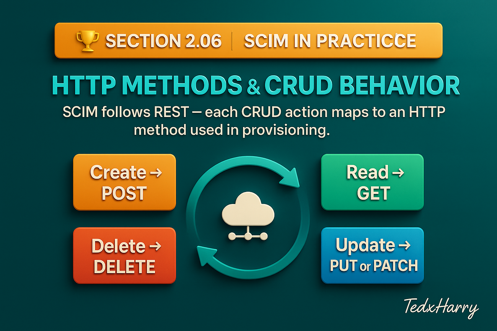

# 🏆 Section 2.06 | SCIM in Practice | “HTTP Methods & CRUD Behavior”

SCIM is built on top of **REST principles**, so every operation is tied to an HTTP method.  
Understanding how **CRUD (Create, Read, Update, Delete)** maps to SCIM operations is essential for implementing and troubleshooting provisioning.  

This section goes beyond HTTP basics, it shows how CRUD plays out in real SCIM requests, what pitfalls to avoid, and which best practices to follow.  

---

## 📖 CRUD in SCIM at a Glance  

- **Create → POST**  
- **Read → GET**  
- **Update → PUT or PATCH**  
- **Delete → DELETE**  

Each of these has subtle but important rules in SCIM.  

---

## 1️⃣ Create → `POST`  

- Used to create a new User or Group.  
- Sent to the **collection endpoint** (`/Users` or `/Groups`).  
- Server assigns the `id`.  
- Returns `201 Created` with the full resource.  

**Example: Create a new User**  

```http
POST /Users
Content-Type: application/scim+json

{
  "schemas": ["urn:ietf:params:scim:schemas:core:2.0:User"],
  "userName": "jane.doe",
  "displayName": "Jane Doe",
  "emails": [
    { "value": "jane.doe@company.com", "type": "work", "primary": true }
  ]
}
```

---

## 2️⃣ Read → `GET`  

- Fetch a single resource: `GET /Users/{id}`  
- Or fetch all with filtering: `GET /Users?filter=userName eq "jane.doe"`  
- Returns `200 OK` with JSON body.  

**Example: Get one user**  

```http
GET /Users/2819c223-7f76-453a-919d-413861904646
```

**Example: Get all active users**  

```http
GET /Users?filter=active eq true
```

---

## 3️⃣ Update → `PUT` vs `PATCH`  

Both update resources but behave very differently.  

### `PUT` (Full Replace)  
- Replaces the **entire resource** with the new payload.  
- Omit attributes → they get wiped.  
- Risky for large or complex resources.  

**Example: Replace User**  

```http
PUT /Users/2819c223-7f76-453a-919d-413861904646
Content-Type: application/scim+json

{
  "schemas": ["urn:ietf:params:scim:schemas:core:2.0:User"],
  "userName": "jane.doe",
  "displayName": "Jane Doe (Updated)",
  "active": true
}
```

⚠️ If you forget `emails`, they’ll be removed because PUT overwrites.  

---

### `PATCH` (Partial Update)  
- Updates only specified attributes.  
- Safer for incremental changes (emails, group membership, active status).  
- Supported since SCIM 2.0, but not always fully implemented by vendors.  

**Example: Update user’s displayName**  

```http
PATCH /Users/2819c223-7f76-453a-919d-413861904646
Content-Type: application/scim+json

{
  "schemas": ["urn:ietf:params:scim:api:messages:2.0:PatchOp"],
  "Operations": [
    {
      "op": "replace",
      "path": "displayName",
      "value": "Jane A. Doe"
    }
  ]
}
```

---

## 4️⃣ Delete → `DELETE`  

- Removes a resource: `DELETE /Users/{id}`.  
- Returns `204 No Content`.  
- **Rarely recommended** in enterprise — deletes remove history and break references.  

👉 Instead, set `active:false` with PATCH.  
This keeps the record but disables login.  

**Example: Deactivate User**  

```http
PATCH /Users/2819c223-7f76-453a-919d-413861904646
Content-Type: application/scim+json

{
  "schemas": ["urn:ietf:params:scim:api:messages:2.0:PatchOp"],
  "Operations": [
    { "op": "replace", "path": "active", "value": false }
  ]
}
```

---

## ⚠️ Common Pitfalls (and Impact)  

- ❌ **Using PUT instead of PATCH** → accidentally wipes attributes.  
- ❌ **Assuming DELETE is safe** → breaks audit history and references.  
- ❌ **Vendor doesn’t fully support PATCH** → some only allow replace, not add/remove.  
- ❌ **Not checking `/ServiceProviderConfig`** → you may try an unsupported operation.  

---

## ✅ Best Practices  

- Use `PATCH` for incremental changes (groups, emails, active state).  
- Use `PUT` only when replacing the **entire resource intentionally**.  
- Avoid `DELETE` — use `active:false` for deprovisioning.  
- Always check `/ServiceProviderConfig` to confirm supported methods.  
- Ensure `POST` payloads always include `schemas` and required attributes.  

---

## 📝 Self-Check  

1️⃣ Why is PATCH safer than PUT for updates?  
2️⃣ What’s the risk of using DELETE in enterprise provisioning?  
3️⃣ Which endpoint do you send POST requests to when creating a new user?  
4️⃣ How can you verify if PATCH is supported by a Service Provider?  

---

## 🎯 Final Takeaway  

CRUD in SCIM is simple in theory but tricky in practice.  
- `POST` creates, `GET` reads.  
- `PUT` replaces everything ... use with caution.  
- `PATCH` updates incrementally .... best choice for most cases.  
- `DELETE` should usually be avoided .... prefer `active:false`.  

💡 Mastering these operations helps you design safe, reliable provisioning flows.  

---

## 🔗 Navigation  

👉 Back: [2.05 Custom Extensions](2.05-custom-extensions.md)  
👉 Next: [2.07 Advanced Filtering & Query Parameters](2.07-advanced-filtering.md)  
