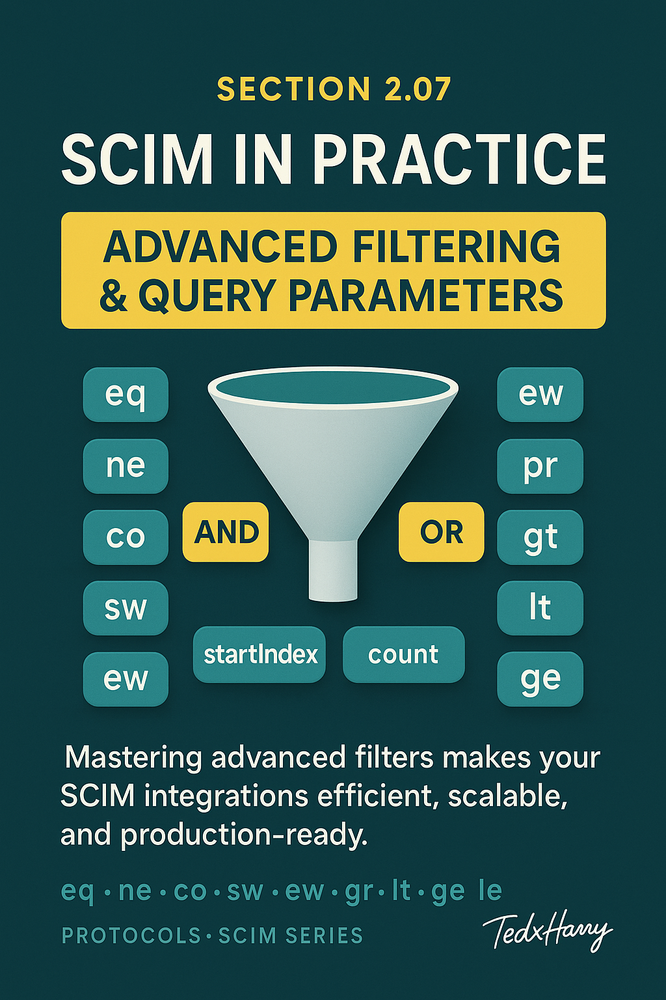

# 🏆 Section 2.07 | SCIM in Practice | “Advanced Filtering & Query Parameters”

Filtering is one of SCIM’s most powerful features.  
You learned the basics in Section 1.06 — simple comparisons like `userName eq "jane.doe"`.  

Now it’s time to go deeper. In real-world provisioning, you’ll need to filter by **multiple attributes**, apply **logical operators**, query inside **multi-valued attributes**, and combine filters with **pagination**.  

---

## 📖 Why Advanced Filtering Matters  

- **Efficiency** → Fetch only the identities you need instead of pulling everything.  
- **Precision** → Narrow down queries to specific users, departments, or roles.  
- **Scalability** → Essential when dealing with thousands of users.  

Without filtering, integrations become heavy, slow, and error-prone.  

---

## 1️⃣ Supported Operators (Recap + Advanced)  

- `eq` → equal  
- `ne` → not equal  
- `co` → contains  
- `sw` → starts with  
- `ew` → ends with  
- `pr` → present (attribute exists)  
- `gt`, `lt`, `ge`, `le` → numeric/date comparisons  

**Example: All users created after Jan 1, 2024**  

```http
GET /Users?filter=meta.created gt "2024-01-01T00:00:00Z"
```

---

## 2️⃣ Logical Operators (`and`, `or`)  

Combine multiple conditions.  

**Example: Active engineers**  

```http
GET /Users?filter=active eq true and department eq "Engineering"
```

**Example: Users in Finance OR HR**  

```http
GET /Users?filter=department eq "Finance" or department eq "HR"
```

---

## 3️⃣ Filtering Multi-Valued Attributes (Path Filters)  

You can filter inside arrays like `emails` or `phoneNumbers`.  

**Example: Work emails ending with @example.com**  

```http
GET /Users?filter=emails[type eq "work" and value co "@example.com"]
```

Here:  
- `emails` is multi-valued.  
- The filter applies only to `type=work`.  

---

## 4️⃣ Filtering Groups by Membership  

Find all users in a specific group.  

```http
GET /Users?filter=groups.value eq "a1b2c3d4"
```

This returns all users who belong to the group with `id = a1b2c3d4`.  

---

## 5️⃣ Combining Filters with Pagination  

For large datasets, combine filtering with pagination.  

**Example: Get first 100 active users in Engineering**  

```http
GET /Users?filter=active eq true and department eq "Engineering"&startIndex=1&count=100
```

---

## ⚠️ Common Pitfalls (and Impact)  

- ❌ **Assuming all vendors support complex filters** → some only allow basic `eq`.  
- ❌ **Case sensitivity issues** → filters may behave differently across platforms.  
- ❌ **Unreadable errors** → many SPs just return `400 Bad Request` without details.  
- ❌ **Nested path filters not supported** → advanced queries may silently fail.  
- ❌ **Over-fetching** → not combining pagination leads to performance issues.  

---

## ✅ Best Practices  

- Always check `/ServiceProviderConfig` for supported filters.  
- Keep filters as simple as possible — test them before deploying.  
- Use pagination when expecting large result sets.  
- Don’t rely on full RFC compliance — build fallbacks if a vendor ignores complex queries.  
- Log filter queries and responses to help troubleshoot issues.  

---

## 🏢 Real-World Examples  

- **Find inactive contractors**  

```http
GET /Users?filter=active eq false and userType eq "Contractor"
```

- **Find managers in Engineering**  

```http
GET /Users?filter=title co "Manager" and department eq "Engineering"
```

- **Find users missing work email**  

```http
GET /Users?filter=not emails[type eq "work" and value pr]
```

---

## 📝 Self-Check  

1️⃣ How would you query all users in HR created after 2024?  
2️⃣ What operator checks if an attribute exists?  
3️⃣ Why should you combine pagination with filtering?  
4️⃣ What happens if a Service Provider doesn’t support complex filters?  

---

## 🎯 Final Takeaway  

Filtering is more than just `eq`.  
- Use **logical operators** (`and`, `or`) for precision.  
- Apply **path filters** to search inside multi-valued attributes.  
- Always combine with **pagination** for performance.  
- Expect partial support — not every vendor implements the full RFC.  

💡 Mastering advanced filters makes your SCIM integrations efficient, scalable, and production-ready.  

---

## 🔗 Navigation  

👉 Back: [2.06 HTTP Methods & CRUD Behavior](2.06-http-methods-crud.md)  
👉 Next: [2.08 Pagination & Sorting](2.08-pagination-sorting.md)  
