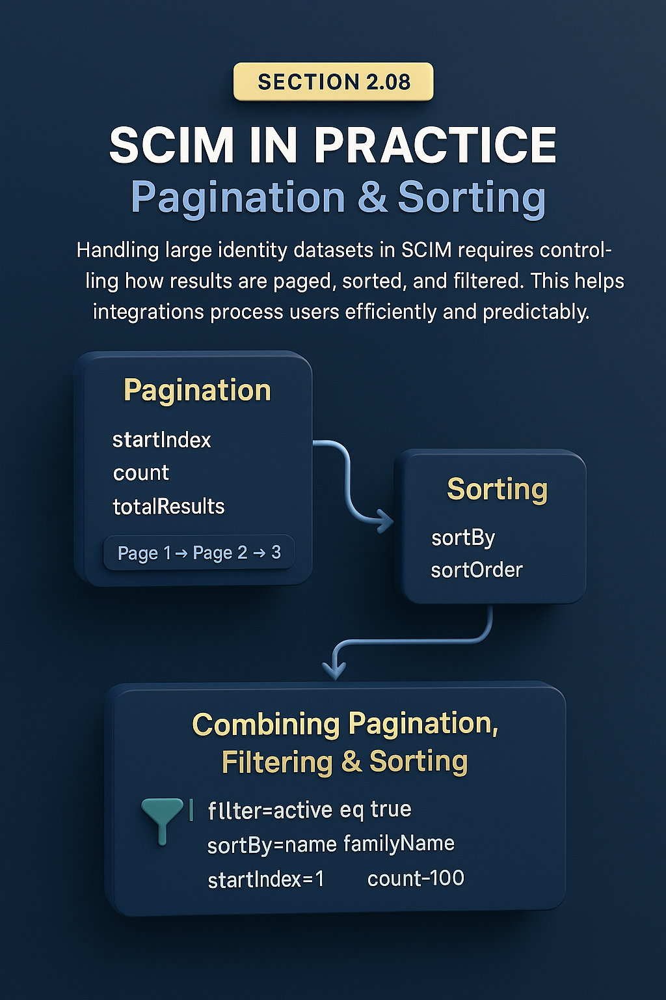

# 🏆 Section 2.08 | SCIM in Practice | “Pagination & Sorting”

When working with SCIM, you rarely deal with just one or two users.  
Enterprise systems often manage **tens of thousands** of identities... which means your integration must handle **large result sets** efficiently.  

That’s where **pagination** and **sorting** come in. These features ensure SCIM APIs return data in manageable chunks, while letting you order results for easier processing.  

---

## 📖 Why Pagination & Sorting Matter  

- **Performance** → Avoids timeouts and giant payloads.  
- **Scalability** → Supports thousands of users without overloading servers.  
- **Consistency** → Ensures reliable syncs across large datasets.  
- **Compliance** → Sorting helps with predictable audits and reporting.  

---

## 1️⃣ Pagination in SCIM  

Pagination is controlled by three main parameters:  

- `startIndex` → the starting position (1-based index).  
- `count` → how many results to return in one page.  
- `totalResults` → returned by the server, tells you how many total items match.  

**Example: First 50 users**  

```http
GET /Users?startIndex=1&count=50
```

**Response:**  

```json
{
  "totalResults": 2350,
  "itemsPerPage": 50,
  "startIndex": 1,
  "Resources": [ ... ]
}
```

**Example: Next 50 users**  

```http
GET /Users?startIndex=51&count=50
```

---

## 2️⃣ Sorting in SCIM  

Sorting makes it easier to process results in a predictable order.  

Parameters:  
- `sortBy` → which attribute to sort on.  
- `sortOrder` → `ascending` (default) or `descending`.  

**Example: Get users sorted by familyName (A → Z)**  

```http
GET /Users?sortBy=name.familyName&sortOrder=ascending
```

**Example: Get groups sorted by displayName (Z → A)**  

```http
GET /Groups?sortBy=displayName&sortOrder=descending
```

---

## 3️⃣ Combining Pagination, Filtering & Sorting  

Real-world queries often mix these features.  

**Example: First 100 active Engineers, sorted by last name**  

```http
GET /Users?filter=active eq true and department eq "Engineering"&startIndex=1&count=100&sortBy=name.familyName&sortOrder=ascending
```

---

## ⚠️ Common Pitfalls (and Impact)  

- ❌ **Assuming default page size** → many SPs default to 100 or 200; don’t rely on it.  
- ❌ **Not checking `totalResults`** → you may miss data if you stop after one page.  
- ❌ **Large `count` values** → can cause timeouts or rejected requests.  
- ❌ **Inconsistent sorting** → some SPs don’t guarantee stable ordering across pages.  
- ❌ **Unsupported sortBy fields** → querying on attributes not indexed may fail.  

---

## ✅ Best Practices  

- Always **read `totalResults`** to know how many pages to request.  
- Choose a **reasonable count** (50–200) for stable performance.  
- Combine pagination with filtering to minimize payload size.  
- Don’t assume every attribute is sortable... test with your SP.  
- Log `startIndex` and `count` values to troubleshoot sync issues.  

---

## 🏢 Real-World Examples  

- **Provisioning Connector** → Fetches all users in pages of 200, continues until `totalResults` reached.  
- **Audit Report** → Sorted by `userName` to generate a clean export.  
- **Departmental Sync** → Filters by department, sorts by last name, fetches in batches.  

---

## 📝 Self-Check  

1️⃣ What SCIM attributes control pagination?  
2️⃣ How do you know when you’ve retrieved all pages?  
3️⃣ Why is it risky to use a very large `count` value?  
4️⃣ Give an example of a query combining filter + pagination + sorting.  

---

## 🎯 Final Takeaway  

Pagination and sorting turn SCIM from a toy protocol into an **enterprise-ready standard**.  

- Use `startIndex`, `count`, and `totalResults` to handle big datasets.  
- Use `sortBy` and `sortOrder` for predictable ordering.  
- Combine with filtering for precise, scalable syncs.  

💡 Reliable pagination and sorting are the backbone of **large-scale provisioning** and **compliance reporting**.  

---

## 🔗 Navigation  

👉 Back: [2.07 Advanced Filtering & Query Parameters](2.07-advanced-filtering.md)  
👉 Next: [2.09 Attribute Selection (`attributes` and `excludedAttributes`)](2.09-attribute-selection.md)  
