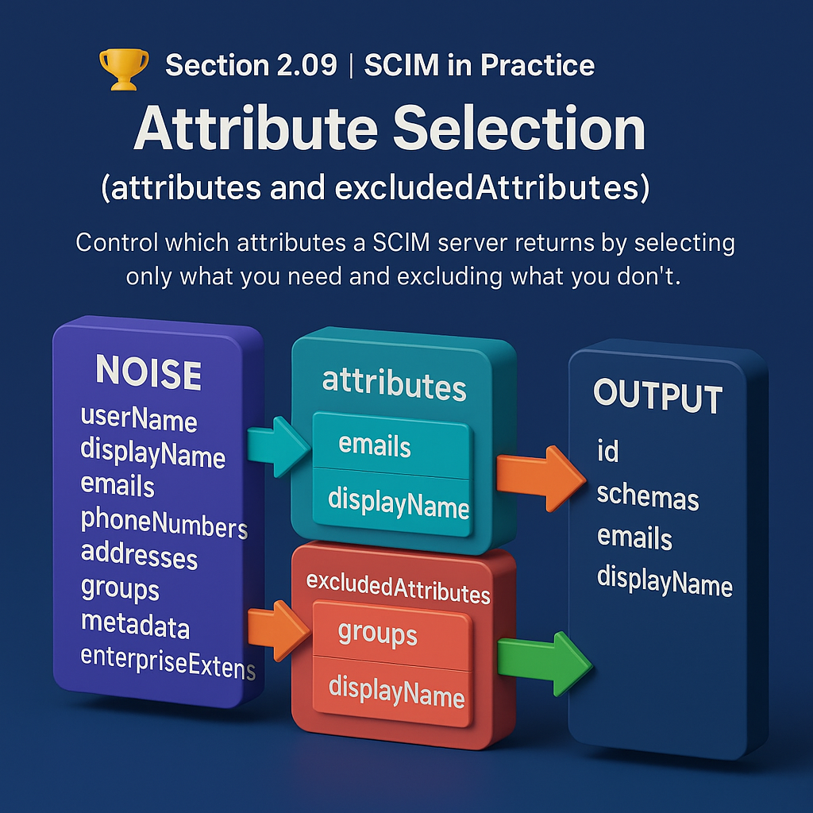

# 🏆 Section 2.09 | SCIM in Practice | “Attribute Selection (`attributes` and `excludedAttributes`)”

Attribute selection allows a SCIM client to control exactly which attributes appear in a SCIM response.
This improves performance, reduces response size, avoids unnecessary noise, and prevents sensitive fields from being exposed.

SCIM provides two powerful query parameters:

* **attributes**
* **excludedAttributes**

Both shape the response that the server returns.
To understand SCIM well, you must know how both behave separately and together.

---

# 📘 1. Why Attribute Selection Exists

When a SCIM resource like a User is returned without filters, you get dozens of fields such as:

* emails
* phoneNumbers
* groups
* manager
* enterprise extension
* addresses
* metadata

Most clients do not need all of this.
IGA platforms especially care about performance and only want attributes required for:

* correlation
* account linking
* lifecycle events
* delta detection
* entitlement sync

Attribute selection makes SCIM efficient and predictable.

---

# 🔧 2. The Two Controls: attributes and excludedAttributes

## ✔ attributes=...
A whitelist.
Return only what is requested.

Example

```
GET /Users/123?attributes=userName,emails,active
```

The server must return only those fields and mandatory SCIM metadata attributes.

---

## ✔ excludedAttributes=...
A blacklist.
Return everything except the listed attributes.

Example

```
GET /Users/123?excludedAttributes=groups,meta
```

Groups and metadata are removed from the final response.

---

# 🧠 3. How The Server Processes Attribute Selection

```
                   Load full resource
                          │
                          ▼
               Is attributes provided?
                     │        │
                    YES      NO
                     │        │
                     ▼        ▼
      Build response with      Keep full object
      ONLY listed attributes   (default SCIM behavior)
                     │
                     ▼
      Apply excludedAttributes if present
                     │
                     ▼
                Return response
```

Key rule  
**attributes has priority**  
First narrow to selected attributes, then remove anything excluded.

---

# 🧩 4. Core Behavior Rules You Must Know

### ✔ Rule 1: attributes overrides excludedAttributes
If both are used:

```
GET /Users?attributes=emails,displayName&excludedAttributes=emails.type
```

Meaning

* Keep only emails and displayName
* From emails, remove type

---

### ✔ Rule 2: Some attributes cannot be removed
Mandatory attributes:

* id
* schemas

They always appear.

---

### ✔ Rule 3: Nested selection works through dot notation
```
attributes=emails.value,addresses.country
```

---

### ✔ Rule 4: Extension attributes require full URNs
```
attributes=urn:ietf:params:scim:schemas:extension:enterprise:2.0:User:department
```

---

# 🧾 5. Practical Examples

## ⭐ Example A: Only selected attributes
```
GET /Users/123?attributes=userName,displayName,emails
```

```json
{
  "id": "123",
  "userName": "ted@example.com",
  "displayName": "Ted",
  "emails": [
    { "value": "ted@example.com", "primary": true }
  ],
  "schemas": ["urn:ietf:params:scim:schemas:core:2.0:User"]
}
```

---

## ⭐ Example B: Excluding large attributes
```
GET /Users/123?excludedAttributes=groups,photos
```

---

## ⭐ Example C: Narrow multi-valued attributes
```
attributes=phoneNumbers.value
```

---

## ⭐ Example D: Combined include and exclude
```
GET /Users?attributes=emails,displayName&excludedAttributes=emails.type
```

---

# 🏢 6. Behavior in Real IAM Tools

## ✔ SailPoint Identity Security Cloud (ISC)
* Uses attributes during aggregation
* Returns minimal JSON
* Strict nested attribute handling

## ✔ SailPoint IdentityIQ (IIQ)
* Older connectors struggle with nested exclusions
* Always returns id and schemas
* Improves recon performance

## ✔ Okta SCIM Servers
* attributes works strongly
* excludedAttributes inconsistent for extensions

## ✔ Azure AD Enterprise SCIM
* Requires URNs for extension attributes
* excludedAttributes sometimes ignored

---

# ⚠️ 7. Common Pitfalls

### ❗ Pitfall 1: Using only emails.value breaks delta detection  
### ❗ Pitfall 2: Excluding meta breaks provisioning  
### ❗ Pitfall 3: Missing enterprise attributes breaks onboarding  
### ❗ Pitfall 4: Case sensitivity issues  
### ❗ Pitfall 5: Servers that ignore filters entirely  

---

# 🧱 8. Real Project Scenarios

### Scenario: Large groups  
```
excludedAttributes=groups
```

### Scenario: Minimalistic aggregation  
```
attributes=id,userName,active,emails.value
```

### Scenario: Privacy filtering  
```
excludedAttributes=phoneNumbers
```

---

# 🧩 9. Attribute Selection in Search Requests

```
POST /Users/.search
{
  "attributes": ["userName", "emails"],
  "filter": "active eq true",
  "startIndex": 1,
  "count": 10
}
```

---

# 📚 10. Quick Comparison Table

| Purpose | Parameter | Behavior |
|--------|-----------|----------|
| whitelist | attributes | Only return these |
| blacklist | excludedAttributes | Remove these |
| both | attributes first | Then exclude |
| mandatory fields | id, schemas | Always returned |
| nested control | dot notation | emails.value |

---

# 🧪 11. Self Check

1. If attributes=userName,emails is given, what happens to other fields?  
They are not returned.

2. Which applies first when both parameters are used?  
attributes first.

3. Can id be excluded?  
No.

## 🎯 Final Takeaway  

Attribute selection makes SCIM responses **lean and controlled**.  
- Use `attributes` to fetch only what you need.  
- Use `excludedAttributes` to skip unneeded or sensitive data.  
- Always confirm support in `/ServiceProviderConfig`.  

💡 Attribute control is key for performance, privacy, and compliance in large-scale integrations.  

---

## 🔗 Navigation  

👉 Back: [2.08 Pagination & Sorting](2.08-pagination-sorting.md)  
👉 Next: [2.10 Bulk Operations](2.10-bulk-operations.md)  
