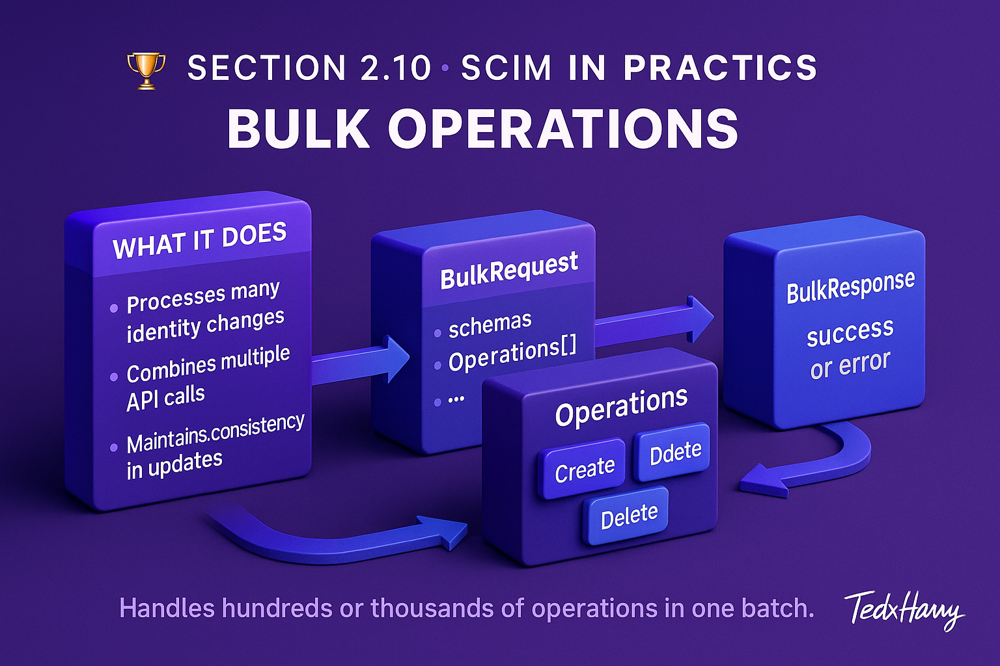

# 🏆 Section 2.10 | SCIM in Practice | “Bulk Operations”

In real enterprise environments, you often need to create, update, or delete **many users at once**.  
Instead of making 1,000 individual API calls, SCIM provides **Bulk Operations**.  

This section explains how bulk works, shows full JSON payloads, and includes hands-on guidance so you can practice it in Postman or your own code.  

---

## 📖 Why Bulk Operations Matter  

- **Efficiency** → process many changes in one request.  
- **Scalability** → avoid hitting rate limits with thousands of single calls.  
- **Consistency** → execute a group of related changes as a single batch.  

Example: when onboarding a new department, you may need to create 300 users and add them to groups in one go.  

---

## 1️⃣ How Bulk Works  

Bulk operations are sent to:  

```http
POST /Bulk
```

The request contains:  
- `schemas` → must include `urn:ietf:params:scim:api:messages:2.0:BulkRequest`.  
- `Operations` → an array of actions (create, update, delete).  

The server responds with:  
- `schemas` → `urn:ietf:params:scim:api:messages:2.0:BulkResponse`.  
- `Operations` → results for each action (success or error).  

---

## 2️⃣ Example: Bulk Create Users  

```http
POST /Bulk
Content-Type: application/scim+json

{
  "schemas": ["urn:ietf:params:scim:api:messages:2.0:BulkRequest"],
  "Operations": [
    {
      "method": "POST",
      "path": "/Users",
      "bulkId": "user1",
      "data": {
        "userName": "alice.smith",
        "displayName": "Alice Smith",
        "emails": [ { "value": "alice.smith@example.com", "type": "work" } ]
      }
    },
    {
      "method": "POST",
      "path": "/Users",
      "bulkId": "user2",
      "data": {
        "userName": "bob.jones",
        "displayName": "Bob Jones",
        "emails": [ { "value": "bob.jones@example.com", "type": "work" } ]
      }
    }
  ]
}
```

💡 Note: `bulkId` lets you reference this resource in later operations (e.g., add `user1` to a group).  

---

## 3️⃣ Example: Bulk Update & Delete  

```http
POST /Bulk
Content-Type: application/scim+json

{
  "schemas": ["urn:ietf:params:scim:api:messages:2.0:BulkRequest"],
  "Operations": [
    {
      "method": "PATCH",
      "path": "/Users/2819c223-7f76-453a-919d-413861904646",
      "data": {
        "schemas": ["urn:ietf:params:scim:api:messages:2.0:PatchOp"],
        "Operations": [
          { "op": "replace", "path": "active", "value": false }
        ]
      }
    },
    {
      "method": "DELETE",
      "path": "/Users/90276df1-3c12-4abc-b21a-553ba7f2c001"
    }
  ]
}
```

---

## 4️⃣ Hands-On Lab: Try It Yourself  

### Setup in Postman  
1. Create a new request → `POST /Bulk`.  
2. Set header → `Content-Type: application/scim+json`.  
3. Paste one of the JSON examples above.  
4. Send the request.  

### What to Observe  
- Successful operations → status `201` (for create) or `200` (for update).  
- Errors → included per-operation in the response.  
- Look for `bulkId` mappings if you referenced them.  

### Example Response (Partial)  

```json
{
  "schemas": ["urn:ietf:params:scim:api:messages:2.0:BulkResponse"],
  "Operations": [
    {
      "method": "POST",
      "bulkId": "user1",
      "status": { "code": 201 }
    },
    {
      "method": "POST",
      "bulkId": "user2",
      "status": { "code": 201 }
    }
  ]
}
```

---

## ⚠️ Common Pitfalls (and Impact)  

- ❌ **Too many operations in one request** → may exceed vendor limits (common cap: 100–500).  
- ❌ **Unsupported bulk** → not all SPs implement `/Bulk`.  
- ❌ **No transactional guarantees** → partial success possible; some ops may succeed while others fail.  
- ❌ **Ignoring bulkId references** → makes group membership or chained operations impossible.  
- ❌ **Timeouts on large payloads** → big batches may fail mid-way.  

---

## ✅ Best Practices  

- Break very large changes into multiple Bulk requests (batches of 100–200).  
- Always log results — don’t assume all operations succeed.  
- Use `bulkId` carefully when chaining (e.g., user → group).  
- Test vendor-specific limits early (some ignore or reject `/Bulk`).  
- Fall back to single operations if bulk isn’t supported.  

---

## 🏢 Real-World Examples  

- **HR Onboarding** → create 200 new interns in one bulk call.  
- **Deprovisioning Wave** → deactivate all contractors at contract end.  
- **License Migration** → bulk update 500 users with new licenseTier.  

---

## 📝 Self-Check  

1️⃣ What is the purpose of `bulkId` in Bulk requests?  
2️⃣ Why should you avoid sending thousands of operations in one batch?  
3️⃣ What happens if one operation in a bulk request fails?  
4️⃣ How do you confirm if a Service Provider supports Bulk?  

---

## 🎯 Final Takeaway  

Bulk Operations are a powerful way to handle **large-scale identity changes** in SCIM.  
- Send many operations in one request.  
- Use `bulkId` to chain related actions.  
- Expect partial success and vendor limits.  

💡 Always test Bulk carefully — it’s efficient but not universally supported.  

---

## 🔗 Navigation  

👉 Back: [2.09 Attribute Selection](2.09-attribute-selection.md)  
👉 Next: [2.11 Deprovisioning & Lifecycle Management in Practice](2.11-deprovisioning.md)  
