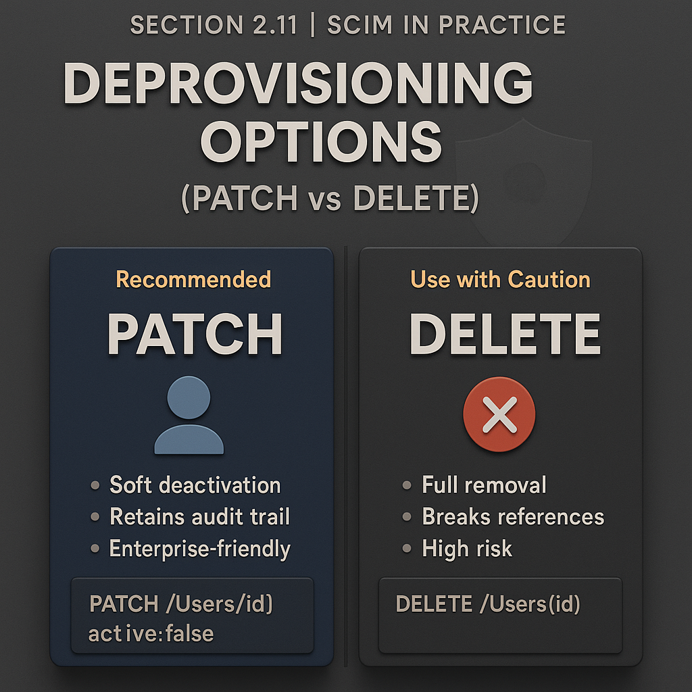

# 🏆 Section 2.11 | SCIM in Practice | “Deprovisioning & Lifecycle Management in Practice”

Provisioning gets the spotlight, but **deprovisioning** is just as critical.  
When employees leave, contractors finish projects, or accounts are no longer needed, you must **remove access quickly and safely**.  

---

## 📖 Why Deprovisioning Matters  

- **Security** → prevent orphan accounts that can be exploited.  
- **Compliance** → ensure ex-employees don’t retain access.  
- **Cost Control** → free up licenses from unused accounts.  
- **Auditability** → leave behind a clear trail of access changes.  

---

## 1️⃣ SCIM Deprovisioning Options  

There are two common approaches:  

### `PATCH` → `active:false` (Preferred)  
- Keeps the resource for audit and references.  
- Disables login without deleting the record.  
- Most enterprise-friendly option.  

```http
PATCH /Users/2819c223-7f76-453a-919d-413861904646
Content-Type: application/scim+json

{
  "schemas": ["urn:ietf:params:scim:api:messages:2.0:PatchOp"],
  "Operations": [
    { "op": "replace", "path": "active", "value": false }
  ]
}
```

### `DELETE` (Rare)  
- Permanently removes the user.  
- Breaks references (e.g., groups, audit history).  
- Some SaaS apps still expect this.  

```http
DELETE /Users/2819c223-7f76-453a-919d-413861904646
```

⚠️ Avoid DELETE unless the vendor explicitly requires it.  

---

## 2️⃣ Lifecycle Management States  

SCIM itself only defines `active`, but enterprises often extend lifecycle concepts:  

- **Active** → account is usable.  
- **Suspended** → account is temporarily disabled (e.g., leave of absence).  
- **Deprovisioned** → account is permanently inactive.  
- **Deleted** → account is fully removed (risky for audit).  

💡 You may need to **map HR lifecycle events** (hire, suspend, terminate, rehire) into SCIM operations.  

---

## 3️⃣ Hands-On Lab: Try It Yourself  

### Setup in Postman  
1. Create a request → `PATCH /Users/{id}`.  
2. Add header → `Content-Type: application/scim+json`.  
3. Paste the `active:false` JSON example.  
4. Send the request.  

### Expected Response  

```json
{
  "id": "2819c223-7f76-453a-919d-413861904646",
  "userName": "jane.doe",
  "active": false,
  "meta": { "lastModified": "2025-10-13T15:04:05Z" }
}
```

### Bonus: Test Delete  
1. Send `DELETE /Users/{id}`.  
2. Expected: `204 No Content`.  
3. Try fetching the user again → should return `404 Not Found`.  

---

## ⚠️ Common Pitfalls (and Impact)  

- ❌ **Using DELETE instead of PATCH** → lose audit history.  
- ❌ **Not deactivating promptly** → leaves security gaps.  
- ❌ **Vendors ignoring `active:false`** → some SPs don’t respect it.  
- ❌ **Forgetting group cleanup** → deactivated users may still show as group members.  
- ❌ **Poor HR integration** → lifecycle events not mapped → users stay active.  

---

## ✅ Best Practices  

- Use `active:false` for safe deprovisioning.  
- Reserve `DELETE` for cases where the vendor explicitly requires it.  
- Always log lifecycle changes for audit.  
- Align SCIM deprovisioning with **HR system events**.  
- Verify downstream apps actually block access after deactivation.  

---

## 🏢 Real-World Scenarios  

- **Employee Termination** → `PATCH active:false` on last working day.  
- **Leave of Absence** → temporarily deactivate (or suspend if supported).  
- **Contractor Offboarding** → bulk deprovision multiple users.  
- **Rehire** → set `active:true` again instead of creating a new account.  

---

## 📝 Self-Check  

1️⃣ Why is PATCH with `active:false` preferred over DELETE?  
2️⃣ What lifecycle states might you implement beyond SCIM’s `active`?  
3️⃣ What’s the risk of vendors ignoring the `active` attribute?  
4️⃣ How should HR events map into SCIM lifecycle operations?  

---

## 🎯 Final Takeaway  

Deprovisioning is the most important security step in SCIM.  
- Always prefer `active:false` to preserve audit history.  
- DELETE only when unavoidable.  
- Map lifecycle states to HR events.  
- Confirm downstream apps respect deprovisioning.  

💡 Proper deprovisioning closes security gaps, keeps compliance intact, and ensures licenses are used efficiently.  

---

## 🔗 Navigation  

👉 Back: [2.10 Bulk Operations](2.10-bulk-operations.md)  
👉 Next: [2.12 SCIM Error Model (and Why It Matters)](2.12-error-model.md)  
