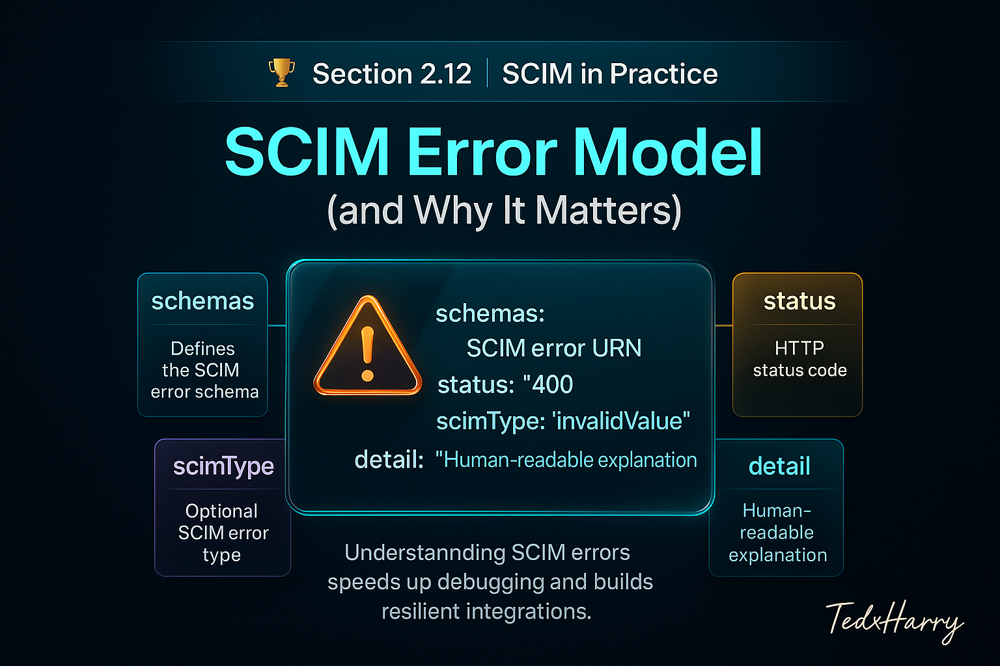

# 🏆 Section 2.12 | SCIM in Practice | “SCIM Error Model (and Why It Matters)”

Every SCIM integration eventually runs into **errors**.  
If you don’t understand how SCIM represents errors, debugging becomes frustrating, and integrations break silently.  

---

## 📖 Why the Error Model Matters  

- **Troubleshooting** → clear errors speed up debugging.  
- **Resilience** → integrations must handle partial failures gracefully.  
- **Compliance** → error codes help prove proper handling of bad requests.  
- **Security** → some errors reveal too much, others too little — balance is key.  

---

## 1️⃣ Structure of a SCIM Error Response  

Errors follow the **SCIM Error Response Schema**.  

**Example:**  

```json
{
  "schemas": ["urn:ietf:params:scim:api:messages:2.0:Error"],
  "status": "400",
  "scimType": "invalidValue",
  "detail": "The 'userName' attribute is required."
}
```

### Fields Explained  
- `schemas` → always includes the SCIM error URN.  
- `status` → HTTP status code (string).  
- `scimType` → SCIM-specific error type (optional).  
- `detail` → human-readable explanation.  

---

## 2️⃣ Common SCIM Error Types  

- **invalidFilter** → filter syntax not valid.  
- **tooMany** → request returns more results than supported.  
- **uniqueness** → attribute must be unique (e.g., `userName`).  
- **mutability** → attribute is read-only or immutable.  
- **invalidValue** → bad data type or value.  
- **invalidSyntax** → malformed request payload.  
- **notFound** → resource not found.  
- **temporarilyUnavailable** → server busy or down.  

---

## 3️⃣ Hands-On Lab: Testing Errors  

### Invalid Filter Example  

```http
GET /Users?filter=unknownAttr eq "test"
```

**Expected Response**  

```json
{
  "schemas": ["urn:ietf:params:scim:api:messages:2.0:Error"],
  "status": "400",
  "scimType": "invalidFilter",
  "detail": "Attribute 'unknownAttr' not supported."
}
```

---

### Uniqueness Violation  

```http
POST /Users
Content-Type: application/scim+json

{
  "userName": "jane.doe",
  "displayName": "Jane Doe"
}
```

(If `jane.doe` already exists)  

```json
{
  "schemas": ["urn:ietf:params:scim:api:messages:2.0:Error"],
  "status": "409",
  "scimType": "uniqueness",
  "detail": "A user with userName 'jane.doe' already exists."
}
```

---

### Mutability Error  

```http
PATCH /Users/12345
Content-Type: application/scim+json

{
  "schemas": ["urn:ietf:params:scim:api:messages:2.0:PatchOp"],
  "Operations": [
    { "op": "replace", "path": "id", "value": "99999" }
  ]
}
```

```json
{
  "schemas": ["urn:ietf:params:scim:api:messages:2.0:Error"],
  "status": "400",
  "scimType": "mutability",
  "detail": "Attribute 'id' is read-only."
}
```

---

## ⚠️ Common Pitfalls (and Impact)  

- ❌ **Ignoring `scimType`** → lose context about what failed.  
- ❌ **Not handling partial failures in Bulk** → one bad record breaks sync.  
- ❌ **Overexposed error details** → risk of leaking system info.  
- ❌ **Vendor inconsistency** → some return plain HTTP errors without SCIM schema.  

---

## ✅ Best Practices  

- Always parse both `status` and `scimType`.  
- Log `detail` for debugging but sanitize before exposing externally.  
- Build retry logic for `temporarilyUnavailable`.  
- Expect differences across vendors — some ignore SCIM error schema.  
- Validate requests before sending to minimize avoidable errors.  

---

## 🏢 Real-World Scenarios  

- **Sync Job** → fails due to uniqueness conflicts → SCIM error response explains the cause.  
- **IAM Audit** → error logs show invalid filters used by a misconfigured connector.  
- **User Deprovisioning** → request fails because the user no longer exists → handled gracefully with `404 notFound`.  

---

## 📝 Self-Check  

1️⃣ What are the key fields in a SCIM error response?  
2️⃣ How does `scimType` add value beyond the HTTP status code?  
3️⃣ Give one example of an error type you might encounter during user creation.  
4️⃣ Why is it risky to expose raw SCIM error details to end users?  

---

## 🎯 Final Takeaway  

SCIM’s error model is simple but powerful.  
- Errors follow a standard schema with `status`, `scimType`, and `detail`.  
- Understanding errors makes troubleshooting faster and integrations more resilient.  
- Always expect vendor differences and handle them gracefully.  

💡 Robust error handling separates a fragile SCIM integration from a production-ready one.  

---

## 🔗 Navigation  

👉 Back: [2.11 Deprovisioning & Lifecycle Management](2.11-deprovisioning.md)  
👉 Next: [2.13 Dealing with Partial Vendor Implementations](2.13-partial-vendor-support.md)  
