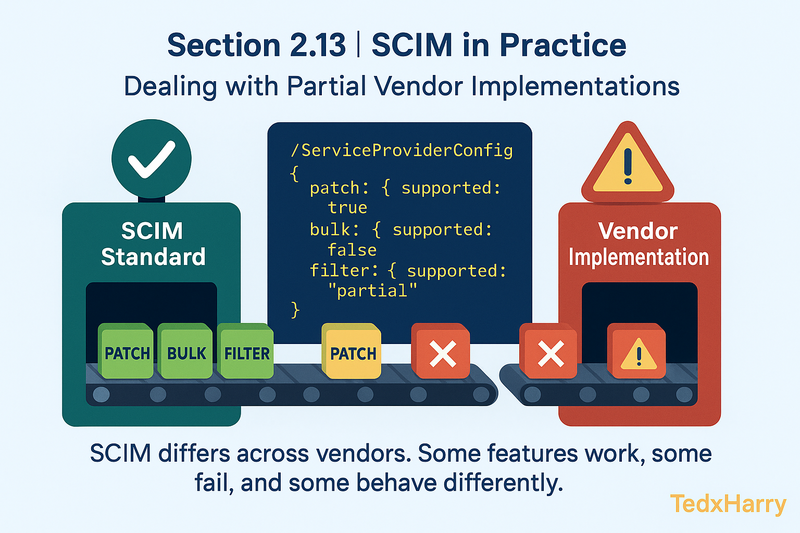

# 🏆 Section 2.13 | SCIM in Practice | “Dealing with Partial Vendor Implementations”

SCIM is a **standard**, but in practice vendors often implement **only parts of the spec**.  
As an engineer, you’ll face differences that can break integrations if you’re not prepared.  

This section explains common gaps, how to detect them, and practical strategies to work around inconsistencies.  

---

## 📖 Why Vendor Variations Happen  

- SCIM is **flexible** → vendors choose what fits their product.  
- Some features are **expensive** to support (bulk, complex filters).  
- Vendors prioritize **business needs** over strict RFC compliance.  
- Different versions of SCIM libraries across platforms.  

Result → no two SCIM integrations behave exactly the same.  

---

## 1️⃣ Common Areas of Partial Support  

- **PATCH** → some vendors only allow `replace`, not `add` or `remove`.  
- **DELETE** → ignored or replaced with `active:false`.  
- **Bulk (`/Bulk`)** → unsupported or heavily limited (max 100 ops).  
- **Filtering** → only `eq` supported, others ignored.  
- **Sorting & Pagination** → inconsistently implemented.  
- **Attributes** → custom attributes dropped silently.  
- **Error Handling** → plain HTTP errors instead of SCIM error schema.  

---

## 2️⃣ Detecting Vendor Support Gaps  

- Check `/ServiceProviderConfig` → lists supported features.  
- Read vendor API docs carefully.  
- Test incrementally → try small requests before scaling up.  
- Observe error responses → often reveal unsupported features.  

**Example: Check if PATCH supported**  

```http
GET /ServiceProviderConfig
```

**Response (excerpt):**  

```json
{
  "patch": { "supported": true },
  "bulk": { "supported": false },
  "filter": { "supported": true, "maxResults": 200 },
  "sort": { "supported": false }
}
```

---

## 3️⃣ Hands-On Lab: Spotting Gaps  

### Step 1 → Query Service Provider Config  

```http
GET /ServiceProviderConfig
```

### Step 2 → Try Unsupported Operation  

If docs say `bulk` not supported → send a Bulk request anyway.  

**Expected Response:**  

```json
{
  "schemas": ["urn:ietf:params:scim:api:messages:2.0:Error"],
  "status": "501",
  "scimType": "invalidSyntax",
  "detail": "Bulk operations are not supported."
}
```

### Step 3 → Adjust Integration  

Fallback to multiple single operations if bulk is missing.  

---

## ⚠️ Common Pitfalls (and Impact)  

- ❌ **Assuming full RFC compliance** → integrations fail unexpectedly.  
- ❌ **Not testing early** → only discover gaps during production rollout.  
- ❌ **Relying on custom attributes** → silently ignored by SP.  
- ❌ **Ignoring pagination limits** → missing data in large sync jobs.  
- ❌ **Assuming PATCH=PUT** → can cause unintended overwrites.  

---

## ✅ Best Practices  

- Always interrogate `/ServiceProviderConfig` before coding.  
- Design integrations to **fall back** when features missing.  
- Log feature detection results for future debugging.  
- Document vendor quirks in your project’s knowledge base.  
- Use **incremental syncs** if filters or sorting are limited.  

---

## 🏢 Real-World Scenarios  

- **Okta → Zoom** → Zoom ignores unsupported filters; must fetch all users + filter client-side.  
- **Azure AD → SaaS App** → app ignores `DELETE`, requires `active:false`.  
- **Custom HR → Vendor X** → Bulk not supported; implemented loop with POST.  

---

## 📝 Self-Check  

1️⃣ What endpoint tells you what features a SCIM Service Provider supports?  
2️⃣ Give one example of a feature often missing in vendor implementations.  
3️⃣ How should you handle a vendor that ignores custom attributes?  
4️⃣ Why is it risky to assume PATCH works the same everywhere?  

---

## 🎯 Final Takeaway  

SCIM is a standard, but **real-world implementations vary widely**.  
- Expect missing features (bulk, filters, PATCH ops).  
- Detect capabilities via `/ServiceProviderConfig`.  
- Build **fallbacks and workarounds** into your integration.  

💡 Robust SCIM engineers don’t just code to the RFC — they design for vendor quirks.  

---

## 🔗 Navigation  

👉 Back: [2.12 SCIM Error Model (and Why It Matters)](2.12-error-model.md)  
👉 Next: [2.14 Performance & Rate Limits](2.14-performance-rate-limits.md)  
